```r
library(pacman)
#devtools::install_github("deleetdk/USA.county.data")
pacman::p_load(tidyverse, maps, tree, USA.county.data)
pacman::p_load(rpart, rpart.plot, rattle, readxl, caret)
#data(USA_county_data)
#d <- read_csv("https://github.com/Deleetdk/USA.county.data/blob/master/Scrape%20and%20tidy%20code/data/tidy_data.csv?raw=true")
data(USA_county_data)
d <- USA_county_data
# Remove leftover statistical data and bad weather data
# https://openpsych.net/paper/12/
ex_cols = c("S","CA","MAR","CFS","ACFS","MeanALC","MaxALC","X","Y","X1")
d <- d %>%
  select(-one_of(ex_cols)) %>%
  select(!matches("_(PRCP|TMAX|TMIN|TAVG)")) %>%
  select(!matches("_bins"))
d <- d %>%
  mutate(prec_pop = Total.Population/precincts)

# Get area/pop dens data
area <- read_excel("land_area.xls")
county_area <- area %>%
    rename(land_area=LND010200D) %>%
    mutate(fips=as.numeric(STCOU)) %>%
    select(fips,land_area)
d <- inner_join(d, county_area, by="fips")
d <- d %>%
  mutate(pop_dens = Total.Population/land_area) %>%
  mutate(log_pd = log(pop_dens)) %>%
  mutate(log_pop = log(Total.Population)) %>%
  mutate(log_pc = log(precincts)) %>%
  mutate(ppc = precincts/Total.Population) %>%
  filter(land_area > 0) %>%
  filter(!is.na(pop_dens)) %>%
  filter(!is.infinite(pop_dens))
d <- d %>% filter(!is.na(dem16_frac2))
```

## Correlations

### For all variables


```r
d_numeric <- d[, unlist(lapply(d, is.numeric))]
correlations <- as.data.frame(cor(
  d_numeric, use="pairwise.complete.obs"
))
```

```
## Warning in cor(d_numeric, use = "pairwise.complete.obs"): the standard deviation
## is zero
```

```r
cor_df_1 <- correlations %>% 
  select(rep16_frac) %>%
  arrange(-abs(rep16_frac))
knitr::kable(cor_df_1 %>% head(15))
```


|                                 | rep16_frac|
|:--------------------------------|----------:|
|rep16_frac                       |  1.0000000|
|rep16_frac2                      |  0.9918778|
|dem16_frac2                      | -0.9918778|
|dem16_frac                       | -0.9834403|
|rep12_frac2                      |  0.9354249|
|dem12_frac2                      | -0.9354249|
|dem12_frac                       | -0.9348959|
|rep12_frac                       |  0.9345204|
|dem08_frac                       | -0.9084699|
|rep08_frac2                      |  0.9056343|
|dem08_frac2                      | -0.9056343|
|rep08_frac                       |  0.9019726|
|votes16_duncanr                  | -0.7862420|
|votes16_none_of_these_candidates | -0.7278439|
|votes16_giordanir                | -0.5379842|

### Not counting previous voting


```r
d_numeric <- d[, unlist(lapply(d, is.numeric))]
d_cor <- d_numeric %>% 
    select(!starts_with("vote")) %>%
    select(!matches("...(08|12)_frac.*")) %>%
    select(!matches("[a-z][0-9][0-9]$")) %>%
    select(!ends_with("frac2"))
d_cor <- 
  d_cor[,!grepl("(?<!rep)16_frac.*",colnames(d_cor),perl=T)]

correlations_2 <- as.data.frame(cor(
  d_cor, use="pairwise.complete.obs", method="pearson"
))

cor_df_2 <- correlations_2 %>% 
  select(rep16_frac) %>%
  arrange(-abs(rep16_frac)) %>%
  distinct(rep16_frac, .keep_all = T)
knitr::kable(cor_df_2 %>% head(15))
```


|                                     | rep16_frac|
|:------------------------------------|----------:|
|rep16_frac                           |  1.0000000|
|White.not.Latino.Population          |  0.5378038|
|Graduate.Degree                      | -0.5342947|
|log_pop                              | -0.5071902|
|White_Asian                          |  0.4986800|
|At.Least.Bachelor.s.Degree           | -0.4930385|
|Sexually.transmitted.infections      | -0.4754802|
|log_pd                               | -0.4604581|
|log_pc                               | -0.4531320|
|Asian.American.Population            | -0.4348100|
|SIRE_homogeneity                     |  0.4155649|
|African.American.Population          | -0.4150909|
|HIV.prevalence.rate                  | -0.4001711|
|Mixedness                            | -0.3886669|
|Children.in.single.parent.households | -0.3813384|

### Using Spearman method


```r
d_numeric <- d[, unlist(lapply(d, is.numeric))]
d_cor <- d_numeric %>% 
    select(!starts_with("vote")) %>%
    select(!matches("...(08|12)_frac.*")) %>%
    select(!matches("[a-z][0-9][0-9]$")) %>%
    select(!ends_with("frac2"))
d_cor <- 
  d_cor[,!grepl("(?<!rep)16_frac.*",colnames(d_cor),perl=T)]

correlations_3 <- as.data.frame(cor(
  d_cor, use="pairwise.complete.obs", method="spearman"
))

cor_df_3 <- correlations_3 %>% 
  select(rep16_frac) %>%
  arrange(-abs(rep16_frac)) %>%
  distinct(rep16_frac, .keep_all = T)
knitr::kable(cor_df_3 %>% head(15))
```


|                                                           | rep16_frac|
|:----------------------------------------------------------|----------:|
|rep16_frac                                                 |  1.0000000|
|Asian.American.Population                                  | -0.5002842|
|Total.Population                                           | -0.4766693|
|Graduate.Degree                                            | -0.4578545|
|White.not.Latino.Population                                |  0.4360950|
|precincts                                                  | -0.4205529|
|reporting                                                  | -0.4191627|
|Injury.deaths                                              |  0.4157215|
|At.Least.Bachelor.s.Degree                                 | -0.4139711|
|Sexually.transmitted.infections                            | -0.4110872|
|pop_dens                                                   | -0.4069272|
|White_Asian                                                |  0.4015622|
|SIRE_homogeneity                                           |  0.4008215|
|Construction.extraction.maintenance.and.repair.occupations |  0.3879461|
|HIV.prevalence.rate                                        | -0.3804431|

## Linear correlation graphs


```r
lin_vars <- rownames(cor_df_2 %>% head(4))
for(var in lin_vars){
  plot <- ggplot(aes_string(x=var,y="rep16_frac"),data=d) +
    geom_point() +
    geom_smooth(method="lm") +
    theme_bw() +
    labs(
      title = paste("Republican fraction in 2016 vs",var,
                    " r=",round(cor_df_2[var,],3))
    )
  print(plot)
}
```

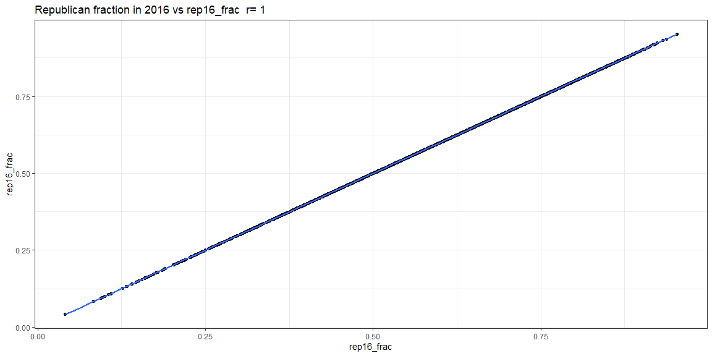<!-- -->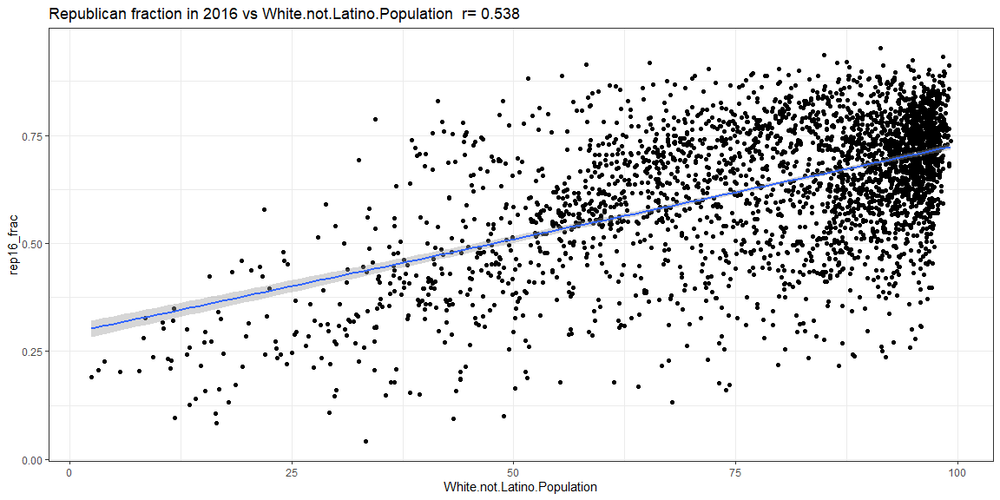<!-- -->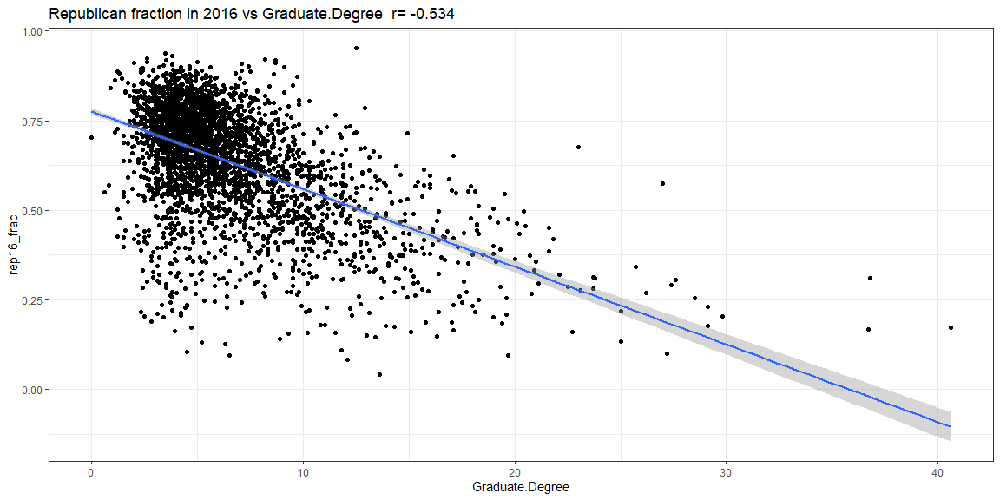<!-- -->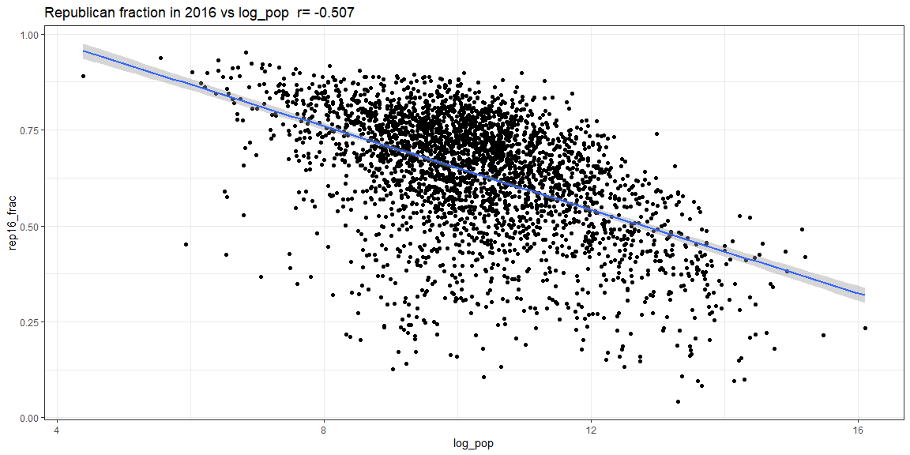<!-- -->

## Other monotonic correlations


```r
cor_m_df <- inner_join(
  (cor_df_3 %>% mutate(nam = rownames(cor_df_3))),
  (cor_df_2 %>% mutate(nam = rownames(cor_df_2))),
  by="nam"
) %>% filter(abs(rep16_frac.x) > abs(rep16_frac.y))
m_vars <- cor_m_df %>%
  arrange(rep16_frac.x) %>%
  head(4) %>%
  pull(nam)
for(var in m_vars){
  plot <- ggplot(aes_string(x=var,y="rep16_frac"),data=d) +
    geom_point() +
    geom_smooth(method="lm") +
    theme_bw() +
    labs(
      title = paste("Republican fraction in 2016 vs",var,
                    " r_s=",round(cor_df_2[var,],3))
    )
  print(plot)
}
```

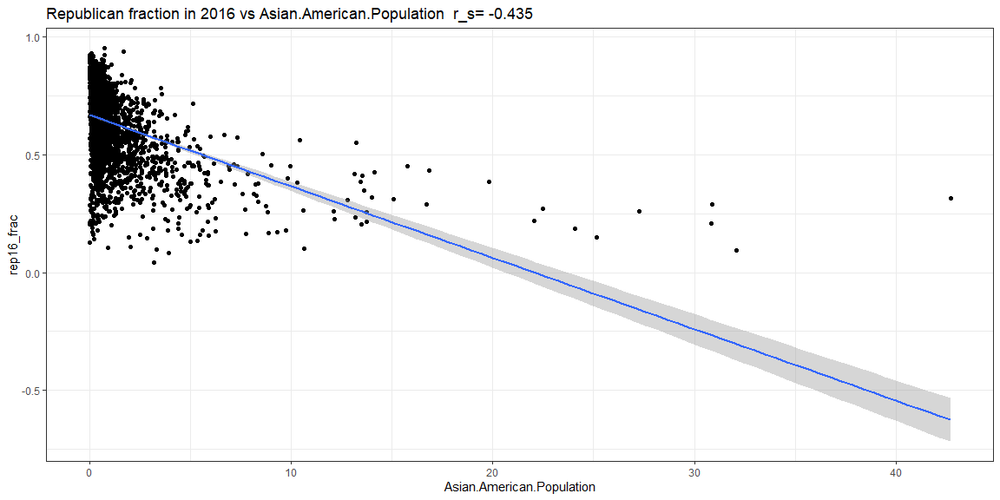<!-- -->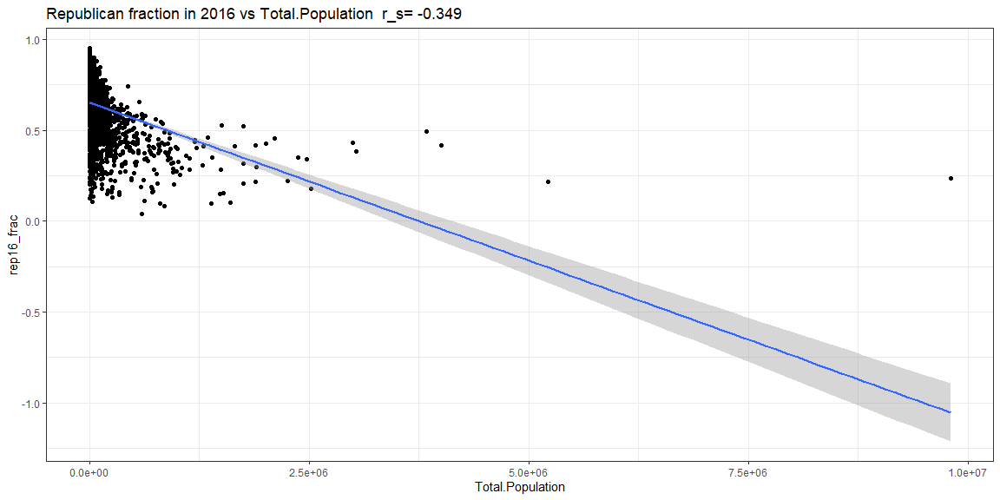<!-- -->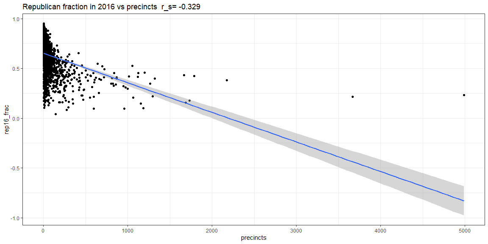<!-- -->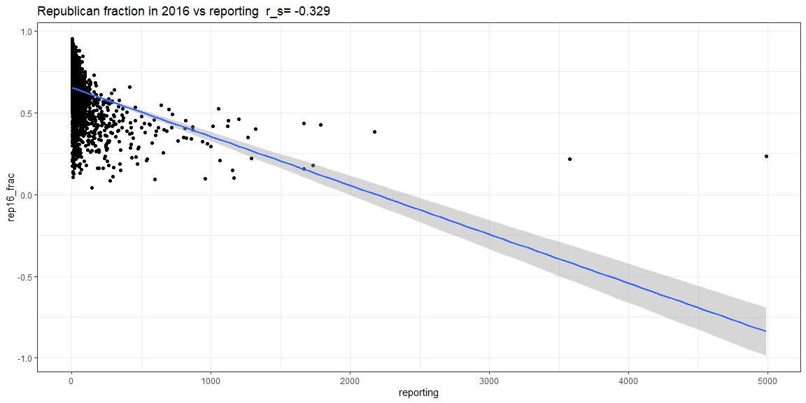<!-- -->

## Preparing the data for prediction


```r
d_numeric <- d[, unlist(lapply(d, is.numeric))]
d_numeric <- d_numeric %>%
  rowwise() %>%
  mutate(dem16_win = (rep16_frac2 < dem16_frac2)) %>%
  ungroup()
d_cor <- d_numeric %>% 
    select(!starts_with("vote")) %>%
    select(!matches("...(08|12)_frac.*")) %>%
    select(!matches("[a-z][0-9][0-9]$")) %>%
    select(!ends_with("frac2"))
d_cor <- 
  d_cor[,!grepl("(?<!rep)16_frac.*",colnames(d_cor),perl=T)]

spearman_cols <- 
  row.names(as.data.frame(cor(
    d_cor, use="pairwise.complete.obs", method="spearman"
  )) %>%
  select(rep16_frac) %>%
  arrange(-abs(rep16_frac)) %>%
  head(15) %>%
  distinct(rep16_frac, .keep_all = T))

pearson_cols <- 
  row.names(as.data.frame(cor(
    d_cor, use="pairwise.complete.obs", method="pearson"
  )) %>%
  select(rep16_frac) %>%
  arrange(-abs(rep16_frac)) %>%
  head(20) %>%
  distinct(rep16_frac, .keep_all = T))

# Just these cols give about 91% testing acc
#pearson_cols <- c("White","log_pd","Black","Hispanic")
important_cols <- c(pearson_cols, "dem16_win","fips")
# Sampling will bias towards the less common D counties, 
# increasing D recall&precision but decreasing overall acc 
d_dem <- d_numeric %>% filter(dem16_win) #%>% sample_n(480)
d_rep <- d_numeric %>% filter(!dem16_win) #%>% sample_n(480)
d_balanced <- bind_rows(d_dem, d_rep)
d_ml <- d_balanced %>%
  #select(important_cols) %>%
  select(!matches("_frac.*")) %>%
  select(!starts_with("vote")) %>%
  select(!matches("[a-z][0-9][0-9]$"))
# Remove cols with NA
d_ml <- d_ml %>%
  select_if(~ !any(is.na(.)))
# Get training data splits
set.seed(seed)
train_index <- createDataPartition(
  d_ml$log_pop, p = 0.8, list = F, times = 1
)
d_train <- d_ml[train_index,]
d_test <- d_ml[-train_index,]
# This will be used for graphing
d_wins <- d %>%
  rowwise() %>%
  mutate(dem16_win = (rep16_frac2 < dem16_frac2)) %>%
  ungroup()
d_preds <- d_wins %>%
  select(fips, dem16_win)
```

## Decision tree


```r
ctrl <- trainControl(method = "repeatedcv", number = 10,
                     repeats = 3, savePredictions = "final")
my_tree <- train(as.factor(dem16_win) ~ .,
                 data=d_train,
                 method="rpart",
                 trControl = ctrl,
                 control=rpart.control(maxdepth=6))
d_tst_pred <- predict(my_tree, d_test, type="raw")
d_pred <- predict(my_tree, d_ml, type="raw")
# 0.01-0.025 seems to be the best complexity parameter value
# Now 0.013-0.017 seems to be about the best
# 0.11 seems close to optimal, but pruning doesn't seem to help
# much
#my_tree <- prune(my_tree,cp=0.011)
d_tst_pred <- predict(my_tree, d_test, type="raw")
d_pred <- predict(my_tree, d_ml, type="raw")
```

### Evalulation Metrics


```r
# Calculate evaluation metrics
print(confusionMatrix(
  data=factor(d_tst_pred), reference=factor(d_test$dem16_win)))
```

```
## Confusion Matrix and Statistics
## 
##           Reference
## Prediction FALSE TRUE
##      FALSE   492   34
##      TRUE     28   66
##                                           
##                Accuracy : 0.9             
##                  95% CI : (0.8736, 0.9225)
##     No Information Rate : 0.8387          
##     P-Value [Acc > NIR] : 7.367e-06       
##                                           
##                   Kappa : 0.6212          
##                                           
##  Mcnemar's Test P-Value : 0.5254          
##                                           
##             Sensitivity : 0.9462          
##             Specificity : 0.6600          
##          Pos Pred Value : 0.9354          
##          Neg Pred Value : 0.7021          
##              Prevalence : 0.8387          
##          Detection Rate : 0.7935          
##    Detection Prevalence : 0.8484          
##       Balanced Accuracy : 0.8031          
##                                           
##        'Positive' Class : FALSE           
## 
```

```r
print(confusionMatrix(
  data=factor(d_pred), reference=factor(d_ml$dem16_win)))
```

```
## Confusion Matrix and Statistics
## 
##           Reference
## Prediction FALSE TRUE
##      FALSE  2460  121
##      TRUE    165  364
##                                          
##                Accuracy : 0.908          
##                  95% CI : (0.8973, 0.918)
##     No Information Rate : 0.8441         
##     P-Value [Acc > NIR] : <2e-16         
##                                          
##                   Kappa : 0.6631         
##                                          
##  Mcnemar's Test P-Value : 0.011          
##                                          
##             Sensitivity : 0.9371         
##             Specificity : 0.7505         
##          Pos Pred Value : 0.9531         
##          Neg Pred Value : 0.6881         
##              Prevalence : 0.8441         
##          Detection Rate : 0.7910         
##    Detection Prevalence : 0.8299         
##       Balanced Accuracy : 0.8438         
##                                          
##        'Positive' Class : FALSE          
## 
```

```r
st <- my_tree$pred %>%
    mutate(tru = (pred == obs)*1) %>%
    group_by(Resample) %>%
    summarise(acc = sum(tru)/n()) %>%
    pull(acc)
knitr::kable(unclass(summary(st)),caption="CV accuracy")
```


Table: CV accuracy

|        |         x|
|:-------|---------:|
|Min.    | 0.8795181|
|1st Qu. | 0.9037108|
|Median  | 0.9154926|
|Mean    | 0.9135234|
|3rd Qu. | 0.9224600|
|Max.    | 0.9516129|

In the decision tree, it is better NOT to balance the dataset (equal number of R and D counties) because then it will be biased towards the less common D counties.


```r
fancyRpartPlot(my_tree$finalModel)
```

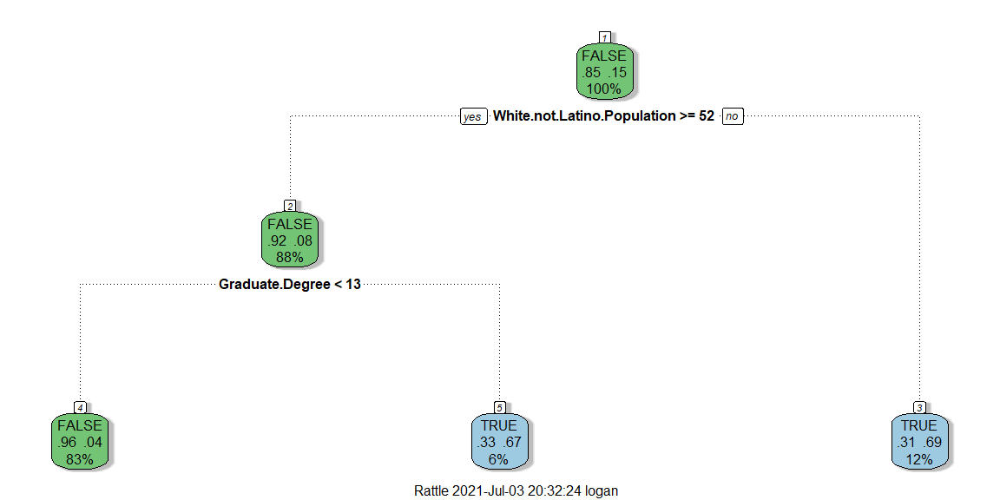<!-- -->

### Graphing Results 


```r
predictions <- 
  as.data.frame(predict(my_tree, d_wins, type="raw")) %>%
  pull()
d_preds$pred_win = predictions
c_fips <- county.fips %>%
  separate(polyname, c("region","subregion"), sep=",")
cty_shape_fips <-
  inner_join(map_data("county"),c_fips,by=c("region","subregion"))
d_graph <- inner_join(d_preds,cty_shape_fips,by="fips")
```

```r
ggplot(d_graph) +
    geom_polygon(aes(x=long,y=lat,group=group,fill=dem16_win),
                 color="white") +
    ggtitle("Actual 2016 results")
```

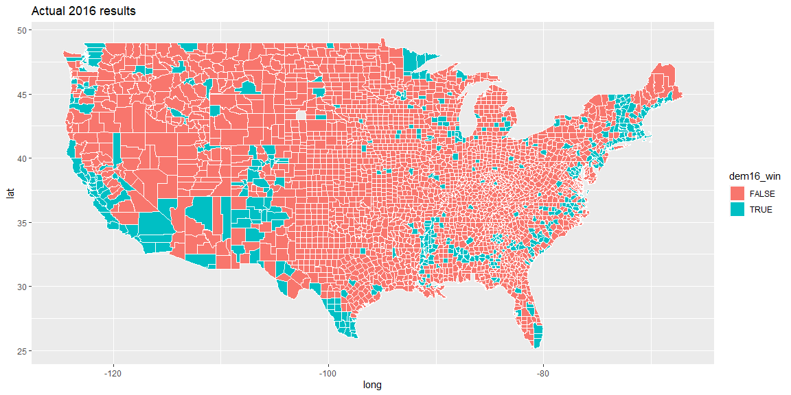<!-- -->

```r
ggplot(d_graph) +
    geom_polygon(aes(x=long,y=lat,group=group,fill=pred_win),
                 color="white") +
    ggtitle("Predicted 2016 results (decision tree model)")
```

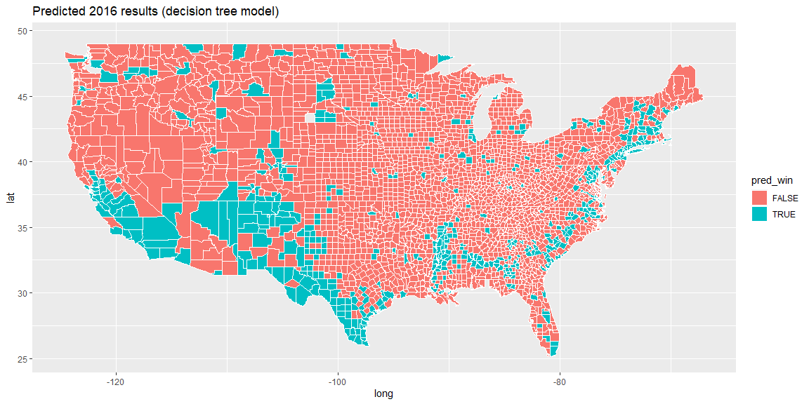<!-- -->

## Linear regression


```r
# Create the model
#d_ml_l <- d_numeric %>% 
#    select(!starts_with("vote")) %>%
#    select(!matches("...(08|12|16)_frac.*")) %>%
#    select(!matches("[a-z][0-9][0-9]$"))
d_ml_l <- d_ml %>% select(!dem16_win)
d_ml_l <- 
  inner_join(d_ml_l, 
             (d %>% select(fips,dem16_frac2)),
             by="fips")
set.seed(seed)
train_index <- createDataPartition(
  d_ml$log_pop, p = 0.8, list = F, times = 1
)
d_train_l <- d_ml_l[train_index,]
d_test_l <- d_ml_l[-train_index,]
# Teen birth data seems hard to come by
#mylm <-
#  lm(dem16_frac2 ~ White + Black + Graduate.Degree + log_pd + lat + White:lat + median_age + White:Black + White:Hispanic + White:Graduate.Degree + White:lon, data=d_train_l)
ctrl <- trainControl(method = "repeatedcv", 
                     number = 10,
                     repeats = 3, 
                     savePredictions = "final")
mylm <- train(dem16_frac2 ~ .,  data=d_train_l, method="lm", trControl=ctrl)
```

```
## Warning in predict.lm(modelFit, newdata): prediction from a rank-deficient fit
## may be misleading

## Warning in predict.lm(modelFit, newdata): prediction from a rank-deficient fit
## may be misleading

## Warning in predict.lm(modelFit, newdata): prediction from a rank-deficient fit
## may be misleading

## Warning in predict.lm(modelFit, newdata): prediction from a rank-deficient fit
## may be misleading

## Warning in predict.lm(modelFit, newdata): prediction from a rank-deficient fit
## may be misleading

## Warning in predict.lm(modelFit, newdata): prediction from a rank-deficient fit
## may be misleading

## Warning in predict.lm(modelFit, newdata): prediction from a rank-deficient fit
## may be misleading

## Warning in predict.lm(modelFit, newdata): prediction from a rank-deficient fit
## may be misleading

## Warning in predict.lm(modelFit, newdata): prediction from a rank-deficient fit
## may be misleading

## Warning in predict.lm(modelFit, newdata): prediction from a rank-deficient fit
## may be misleading

## Warning in predict.lm(modelFit, newdata): prediction from a rank-deficient fit
## may be misleading

## Warning in predict.lm(modelFit, newdata): prediction from a rank-deficient fit
## may be misleading

## Warning in predict.lm(modelFit, newdata): prediction from a rank-deficient fit
## may be misleading

## Warning in predict.lm(modelFit, newdata): prediction from a rank-deficient fit
## may be misleading

## Warning in predict.lm(modelFit, newdata): prediction from a rank-deficient fit
## may be misleading

## Warning in predict.lm(modelFit, newdata): prediction from a rank-deficient fit
## may be misleading

## Warning in predict.lm(modelFit, newdata): prediction from a rank-deficient fit
## may be misleading

## Warning in predict.lm(modelFit, newdata): prediction from a rank-deficient fit
## may be misleading

## Warning in predict.lm(modelFit, newdata): prediction from a rank-deficient fit
## may be misleading

## Warning in predict.lm(modelFit, newdata): prediction from a rank-deficient fit
## may be misleading

## Warning in predict.lm(modelFit, newdata): prediction from a rank-deficient fit
## may be misleading

## Warning in predict.lm(modelFit, newdata): prediction from a rank-deficient fit
## may be misleading

## Warning in predict.lm(modelFit, newdata): prediction from a rank-deficient fit
## may be misleading

## Warning in predict.lm(modelFit, newdata): prediction from a rank-deficient fit
## may be misleading

## Warning in predict.lm(modelFit, newdata): prediction from a rank-deficient fit
## may be misleading

## Warning in predict.lm(modelFit, newdata): prediction from a rank-deficient fit
## may be misleading

## Warning in predict.lm(modelFit, newdata): prediction from a rank-deficient fit
## may be misleading

## Warning in predict.lm(modelFit, newdata): prediction from a rank-deficient fit
## may be misleading

## Warning in predict.lm(modelFit, newdata): prediction from a rank-deficient fit
## may be misleading

## Warning in predict.lm(modelFit, newdata): prediction from a rank-deficient fit
## may be misleading
```

```r
# Predict
thresh <- 0.5
d_tst_pred_l <- (predict(mylm, d_test_l) > thresh)
```

```
## Warning in predict.lm(modelFit, newdata): prediction from a rank-deficient fit
## may be misleading
```

```r
d_pred_l <- (predict(mylm, d_ml_l) > thresh)
```

```
## Warning in predict.lm(modelFit, newdata): prediction from a rank-deficient fit
## may be misleading
```


### Evalulation metrics

```r
# Get evaluation metrics and show them
print(confusionMatrix(
  data=factor(d_tst_pred_l),
  reference=factor(d_test_l$dem16_frac2 > thresh)))
```

```
## Confusion Matrix and Statistics
## 
##           Reference
## Prediction FALSE TRUE
##      FALSE   514   34
##      TRUE      6   66
##                                           
##                Accuracy : 0.9355          
##                  95% CI : (0.9132, 0.9535)
##     No Information Rate : 0.8387          
##     P-Value [Acc > NIR] : 2.593e-13       
##                                           
##                   Kappa : 0.7311          
##                                           
##  Mcnemar's Test P-Value : 1.963e-05       
##                                           
##             Sensitivity : 0.9885          
##             Specificity : 0.6600          
##          Pos Pred Value : 0.9380          
##          Neg Pred Value : 0.9167          
##              Prevalence : 0.8387          
##          Detection Rate : 0.8290          
##    Detection Prevalence : 0.8839          
##       Balanced Accuracy : 0.8242          
##                                           
##        'Positive' Class : FALSE           
## 
```

```r
print(confusionMatrix(
  data=factor(d_pred_l), reference=factor(d_ml_l$dem16_frac2 > thresh)))
```

```
## Confusion Matrix and Statistics
## 
##           Reference
## Prediction FALSE TRUE
##      FALSE  2585  126
##      TRUE     40  359
##                                           
##                Accuracy : 0.9466          
##                  95% CI : (0.9381, 0.9543)
##     No Information Rate : 0.8441          
##     P-Value [Acc > NIR] : < 2.2e-16       
##                                           
##                   Kappa : 0.7815          
##                                           
##  Mcnemar's Test P-Value : 4.188e-11       
##                                           
##             Sensitivity : 0.9848          
##             Specificity : 0.7402          
##          Pos Pred Value : 0.9535          
##          Neg Pred Value : 0.8997          
##              Prevalence : 0.8441          
##          Detection Rate : 0.8312          
##    Detection Prevalence : 0.8717          
##       Balanced Accuracy : 0.8625          
##                                           
##        'Positive' Class : FALSE           
## 
```

```r
st <- mylm$pred %>%
    mutate(tru = (
      (pred > thresh) == (obs > thresh)*1)) %>%
    group_by(Resample) %>%
    summarise(acc = sum(tru)/n()) %>%
    pull(acc)
knitr::kable(unclass(summary(st)),caption="CV accuracy")
```


Table: CV accuracy

|        |         x|
|:-------|---------:|
|Min.    | 0.9112903|
|1st Qu. | 0.9358072|
|Median  | 0.9478939|
|Mean    | 0.9461819|
|3rd Qu. | 0.9556452|
|Max.    | 0.9678715|

### Graphing results


```r
predictions <- 
  as.data.frame((predict(mylm, d_wins) > thresh)) %>%
  pull()
```

```
## Warning in predict.lm(modelFit, newdata): prediction from a rank-deficient fit
## may be misleading
```

```r
d_preds$pred_win = predictions
c_fips <- county.fips %>%
  separate(polyname, c("region","subregion"), sep=",")
cty_shape_fips <-
  inner_join(map_data("county"),c_fips,by=c("region","subregion"))
d_graph_l <- inner_join(d_preds,cty_shape_fips,by="fips")
```

```r
ggplot(d_graph_l) +
    geom_polygon(aes(x=long,y=lat,group=group,fill=dem16_win),
                 color="white") +
    ggtitle("Actual 2016 results")
```

<!-- -->

```r
ggplot(d_graph_l) +
    geom_polygon(aes(x=long,y=lat,group=group,fill=pred_win),
                 color="white") +
    ggtitle("Predicted 2016 results (linear model)")
```

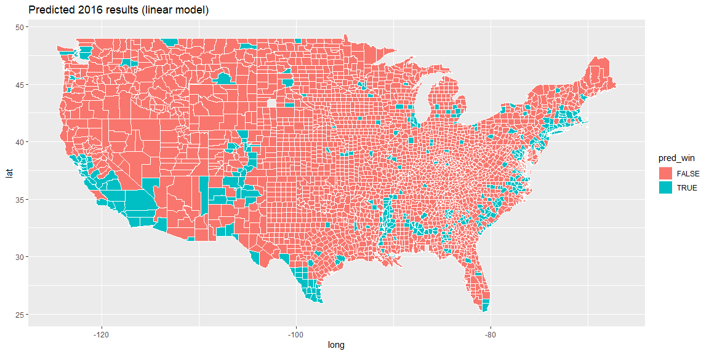<!-- -->
