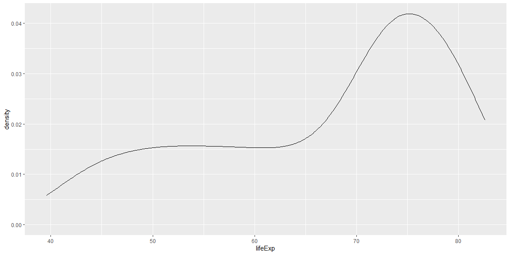
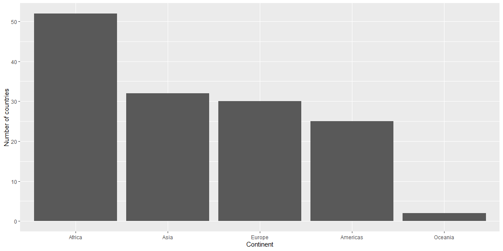
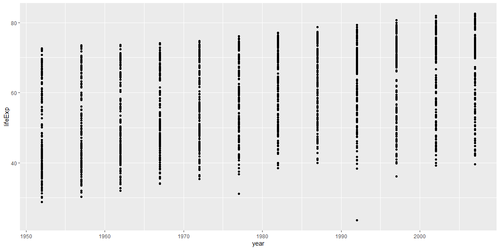
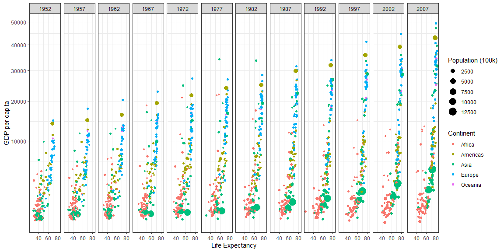

## Reading Notes


## Case Study 3: Wealth and Life Expectancy

### Quantitative distribution chart

This chart shows the distribution of life expectancy in the year 2007.


```r
gm %>% filter(year == 2007) %>%
  ggplot(aes(x=lifeExp)) + geom_density()
```

<!-- -->

This chart is a density chart, which is sort of a smoothed histogram. This data showed that the distribution of life expectancies is left-skewed. The area of the highest density is at 75 years old, which means that this is approximately the mode of world life expectancies in 2007. This graph also shows that countries with long life expectancies are more common than countries with low ones.

### Qualitative distribution chart

This chart shows the distribution of continents, how many countries are in each continent.


```r
gm %>% 
    distinct(country, continent) %>%
    group_by(continent) %>%
    summarise(count=n()) %>%
    ggplot(aes(x=reorder(continent,-count),y=count)) +
    xlab("Continent") +
    ylab("Number of countries") +
    geom_bar(stat='identity')
```

<!-- -->

This chart shows that Africa by far has the most countries. I expected that because Africa has a lot of countries. Asia is second, but I expected it to be a bit closer. However, a lot of Asia's landmass is taken up by large countries, namely Russia, China, and India. Oceania is a definite last, as it is again, taken up by large landmasses, namely Australia and Indonesia.

### Bivariate distribution chart

This chart is a scatterplot showing the relationship between the year and the life expectancy for each country.


```r
gm %>%
    ggplot(aes(x=year,y=lifeExp)) +
    geom_point()
```

<!-- -->

This graph shows that in general since the 1950s, average life expectancy for almost all countries has been increasing steadily. There have been some outliers in the data, but the trend still stands.

### Recreated graphic


```r
gm %>% mutate(pop100k = pop/100000) %>%
    ggplot(aes(x=lifeExp,y=gdpPercap,color=factor(continent))) +
    geom_point(aes(size=pop100k)) +
    facet_wrap("year",nrow=1) +
    scale_y_continuous(trans = "sqrt") +
    theme_bw() +
    xlab("Life Expectancy") +
    ylab("GDP per capita") +
    labs(color = "Continent") +
    labs(size = "Population (100k)")
```

<!-- -->

```r
#ggsave("plot.png",units="in",width=15)
```
