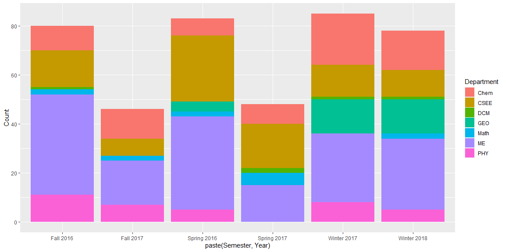

## Task 6: Fix This Chart

Here is the original chart. I have commented each line of code in the chart to show what it does.

```r
library(readr) # Import CSV reading library
library(ggplot2) # Import graphing library

rcw <- read_csv("https://byuistats.github.io/M335/data/rcw.csv", # Read the CSV from the internet
                col_types = cols(Semester_Date = col_date(format = "%m/%d/%y"), # Specify the date format for the date column
                                 Semester = col_factor(levels = c("Winter", "Spring", "Fall")))) # Give the semester column 3 options, Winter, Spring, and Fall
head(rcw) # Get the first few rows of the dataset and print them
```

```
## # A tibble: 6 x 5
##    Year Semester Semester_Date Count Department
##   <dbl> <fct>    <date>        <dbl> <chr>     
## 1  2016 Spring   2016-04-01        7 Chem      
## 2  2016 Fall     2016-09-01       10 Chem      
## 3  2017 Winter   2017-01-01       21 Chem      
## 4  2017 Spring   2017-04-01        8 Chem      
## 5  2017 Fall     2017-09-01       12 Chem      
## 6  2018 Winter   2018-01-01       16 Chem
```

```r
ggplot(data = rcw, # Plot with the RCW dataset
       mapping = aes(x = Semester_Date, # Set the X axis to the semester
                     y = Count, # Set y axis to number of people attending
                     color = Department)) + # Set color to be based on department.
  geom_line() + # Make the graph a line graph
  geom_point() # Make the graph also a point graph
```

<!-- -->

In this graph, there are definite trends. The ME department fairly consistently has the highest attendance, but it did suffer a decline in 2017 followed by a recovery. Mid-2017 seemed to be a low point for all departments. The Math and DCM departments have consistently had the lowest attendance.

I have made my own graph to represent the data, shown here:

```r
ggplot(data = rcw, mapping = aes(fill=Department,x=paste(Semester,Year),y=Count)) + geom_bar(stat="identity")
```

<!-- -->

I used this style of chart because it helps to show the relative popularity of one group compared to another for each semester. I used the new function geom_bar() from the readings to make this graph.
