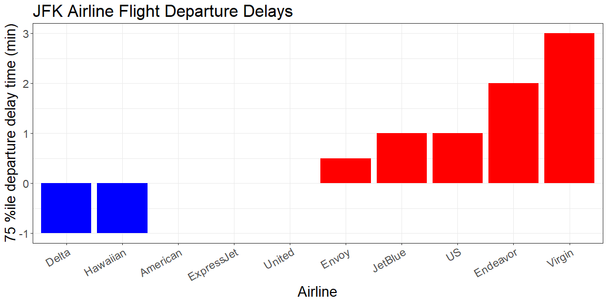
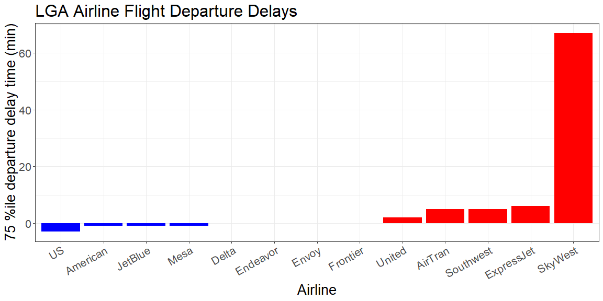
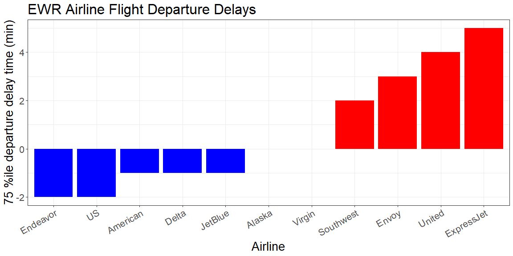
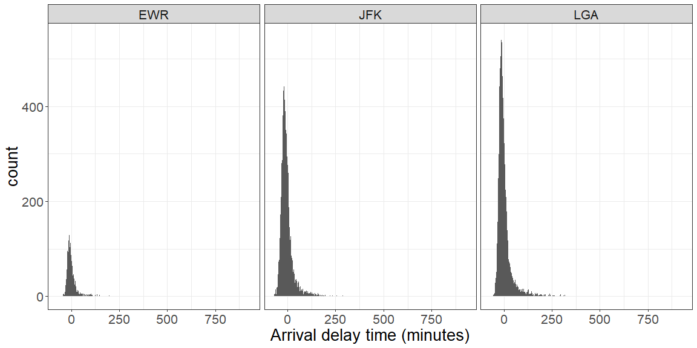
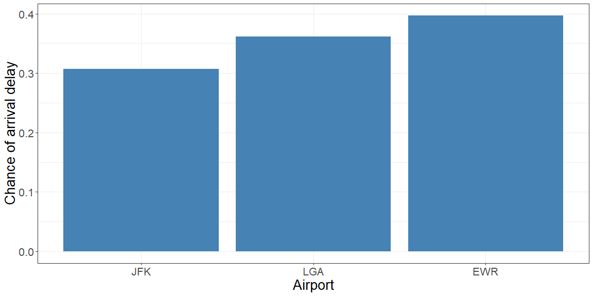

```r
#install.packages("nycflights13")
library(nycflights13)
library(tidyverse)
```

### Question 1: If I am leaving before noon, which two airlines do you recommend at each airport (JFK, LGA, EWR) that will have the lowest delay time at the 75th percentile?

For all flights leaving before noon, I calculated the 75th percentile of the delay time and grouped those results by airline and by airport. The results are shown in the graphs below. Airlines in blue have a 75th percentile of flight departure delay times of less than 0, meaning that at least 75% of the time, the aircraft departs early.


```r
# Only choose flights that leave before noon
early <- flights %>% filter(sched_dep_time < 1200)
# Create a function to graph data from airport
graph_airport <- function(airport){
  # Get flights from airport
  early_airport <- early %>% filter(origin == airport)
  # Get 75th percentile departure delay for those fights,
  # grouped by airline
  delays <- early_airport %>% 
    group_by(carrier) %>%
    summarise(k=quantile(dep_delay,0.75,na.rm = TRUE)) %>%
    ungroup() %>%
    arrange(k)
  # Add the names of the airlines
  delays <- right_join(airlines, delays)
  # Make a column with the short airline name
  delays <- delays %>%
    rowwise() %>%
    mutate(short_name = unlist(strsplit(name," "))[1]) %>%
    ungroup()
  # Add a 'sign' variable for extra coloration
  delays <- delays %>% mutate(sgn = ifelse(k >= 0, "1", "0"))
  # Graph the data
  delays %>% ggplot(mapping = aes(x = reorder(short_name, k),
                                  y = k, fill = sgn)) +
      geom_col() +
      scale_fill_manual(values = c("1" = "red", "0" = "blue")) +
      guides(fill = FALSE) +
      xlab("Airline") +
      ylab("75 %ile departure delay time (min)") +
      ggtitle(paste(airport, "Airline Flight Departure Delays")) +
      theme_bw() +
      theme(axis.text.x = element_text(angle=30,hjust=1),
            text = element_text(size=20))
}
# Graph data for JFK
graph_airport("JFK")
```

<!-- -->

```r
# Graph data for LGA
graph_airport("LGA")
```

<!-- -->

```r
# Graph data for EWR
graph_airport("EWR")
```

<!-- -->

In these graphs, the data shows the airlines with the lowest and highest 75th percentile departure delay times for each airport. At JFK airport, Delta and Hawaiian Airlines have the two lowest departure delay times. At LGA, the two airline with the lowest delay times are US Airways and American Airlines. Finally, at EWR airport the airlines with the two lowest delay times are Endeavor and US Airways.

### Question 2: Which origin airport is best to minimize my chances of a late arrival when I am using Delta Airlines?

This next graph shows arrival delay time for each Delta flight, grouped by airport, in the form of a histogram.


```r
flights %>%
    filter(carrier == "DL") %>%
    ggplot(mapping = aes(x=arr_delay))+
    geom_histogram(binwidth=1, na.rm = TRUE)+
    facet_wrap("origin",nrow=1)+
    xlab("Arrival delay time (minutes)") +
    theme_bw() +
    theme(text = element_text(size=20))
```

<!-- -->

This data of counts of individual flights shows that all the airports have a similar relative frequency of late flights. To show the exact chances of a flight being late for each airport, I graphed data of the chance of a flight being delayed on arrival for each origin airport below.


```r
flight_list <- flights %>%
  filter(carrier == "DL") %>%
  mutate(delayed = ifelse(arr_delay > 0,1,0)) %>%
  group_by(origin) %>%
  summarise(k = sum(delayed,na.rm = TRUE),n=n()) %>%
  mutate(delay_chance = k/n)
flight_list %>%
  ggplot(mapping = aes(x = reorder(origin, delay_chance),
                         y = delay_chance)) +
  geom_col(fill="steelblue") +
  xlab("Airport") +
  ylab("Chance of arrival delay") +
  theme_bw() +
  theme(text = element_text(size=20))
```

<!-- -->

This graph of the probability of a Delta flight being delayed on arrival shows that JFK airport has the lowest chance of arrival delay.
