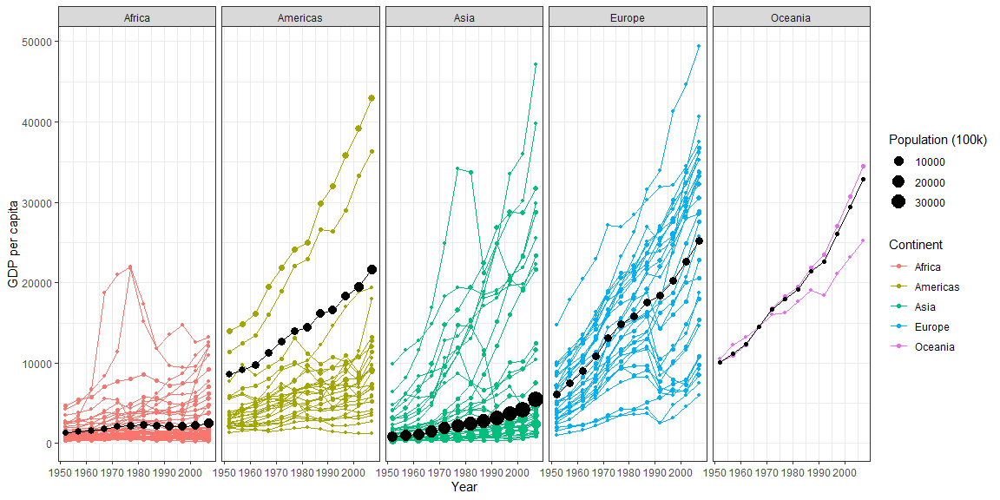
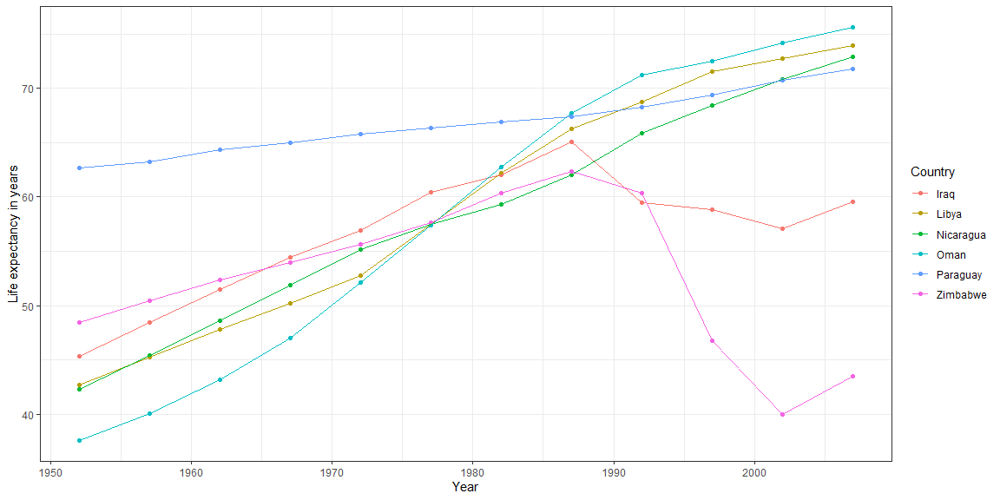

## Task 8

### Recreated Graphic

Here is the recreated graphic:


```r
gm_sum <- gm %>% 
  group_by(continent, year) %>% 
  summarise(mean_gdp = weighted.mean(gdpPercap, pop100k), country = country, pop100k = pop100k, gdpPercap = gdpPercap, sum_pop = sum(pop100k))
```

```
## `summarise()` has grouped output by 'continent', 'year'. You can override using the `.groups` argument.
```

```r
ggplot(gm_sum, aes(x = year)) + 
  geom_point(mapping = aes(color = continent, size = pop100k, y = gdpPercap)) +
  geom_line(mapping = aes(group = country, color = continent, y = gdpPercap)) +
  geom_point(mapping = aes(size = sum_pop, y = mean_gdp), color = "black") +
  geom_line(mapping = aes(group = continent, y = mean_gdp), color = "black") +
  facet_grid(.~continent) +
  theme_bw() +
  xlab("Year") +
  ylab("GDP per capita") +
  guides(color = guide_legend("Continent"),
         size = guide_legend("Population (100k)"))
```

<!-- -->

### Largest increase in life expectancy


```r
exp_07 <- gm %>% 
  filter(year == 2007) %>% 
  mutate(le_07 = lifeExp) %>%
  select(c(country,continent,le_07))
exp_52 <- gm %>%
  filter(year == 1952) %>% 
  mutate(le_52 = lifeExp) %>%
  select(c(country,continent,le_52)) 
life_exp <- exp_07 %>%
  full_join(exp_52, by = c("country","continent")) %>%
  mutate(le_diff = le_07 - le_52)
```

The country in the Americas with the largest life expectancy increase is Nicaragua, with a 30.6 year increase from 1952 to 2007.


```r
life_exp %>% 
    filter(continent == "Americas") %>%
    arrange(desc(le_diff)) %>% head(1)
```

```
## # A tibble: 1 x 5
##   country   continent le_07 le_52 le_diff
##   <fct>     <fct>     <dbl> <dbl>   <dbl>
## 1 Nicaragua Americas   72.9  42.3    30.6
```

The country in Africa with the largest life expectancy increase is Libya, with a 31.2 year increase from 1952 to 2007.


```r
life_exp %>% 
    filter(continent == "Asia") %>%
    arrange(desc(le_diff)) %>% head(1)
```

```
## # A tibble: 1 x 5
##   country continent le_07 le_52 le_diff
##   <fct>   <fct>     <dbl> <dbl>   <dbl>
## 1 Oman    Asia       75.6  37.6    38.1
```

The country in Asia with the largest life expectancy increase is Oman, with a 38.1 year increase from 1952 to 2007.


```r
life_exp %>% 
    filter(continent == "Asia") %>%
    arrange(desc(le_diff)) %>% head(1)
```

```
## # A tibble: 1 x 5
##   country continent le_07 le_52 le_diff
##   <fct>   <fct>     <dbl> <dbl>   <dbl>
## 1 Oman    Asia       75.6  37.6    38.1
```

### Smallest increase in life expectancy

The country in the Americas with the smallest life expectancy increase is Paraguay, with a 9.10 year increase from 1952 to 2007.


```r
life_exp %>% 
    filter(continent == "Americas") %>%
    arrange(le_diff) %>% head(1)
```

```
## # A tibble: 1 x 5
##   country  continent le_07 le_52 le_diff
##   <fct>    <fct>     <dbl> <dbl>   <dbl>
## 1 Paraguay Americas   71.8  62.6    9.10
```

The country in Africa with the smallest life expectancy increase is Zimbabwe, with a 4.96 year decrease from 1952 to 2007.


```r
life_exp %>% 
    filter(continent == "Africa") %>%
    arrange(le_diff) %>% head(1)
```

```
## # A tibble: 1 x 5
##   country  continent le_07 le_52 le_diff
##   <fct>    <fct>     <dbl> <dbl>   <dbl>
## 1 Zimbabwe Africa     43.5  48.5   -4.96
```

The country in Asia with the smallest life expectancy increase is Iraq, with a 14.2 year increase. from 1952 to 2007.


```r
life_exp %>% 
    filter(continent == "Asia") %>%
    arrange(le_diff) %>% head(1)
```

```
## # A tibble: 1 x 5
##   country continent le_07 le_52 le_diff
##   <fct>   <fct>     <dbl> <dbl>   <dbl>
## 1 Iraq    Asia       59.5  45.3    14.2
```

### Life expectancy over time


```r
countries <- c("Nicaragua","Libya","Oman",
               "Paraguay","Zimbabwe","Iraq")
dat <- gm %>% filter(country %in% countries)
ggplot(dat, mapping = aes(x = year, y = lifeExp)) +
  geom_point(mapping = aes(group = country, color = country)) +
  geom_line(mapping = aes(group = country, color = country)) +
  theme_bw() +
  xlab("Year") +
  ylab("Life expectancy in years") +
  guides(color = guide_legend("Country"))
```

<!-- -->
