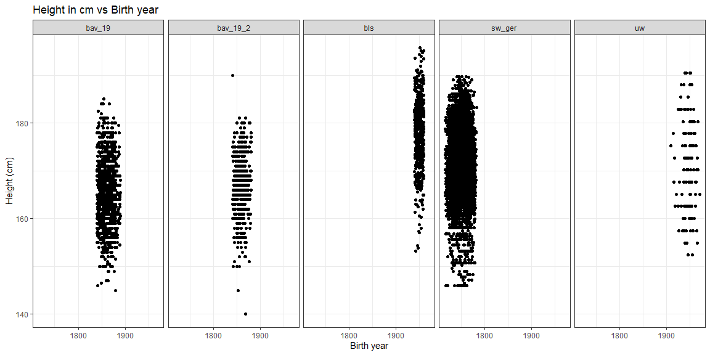
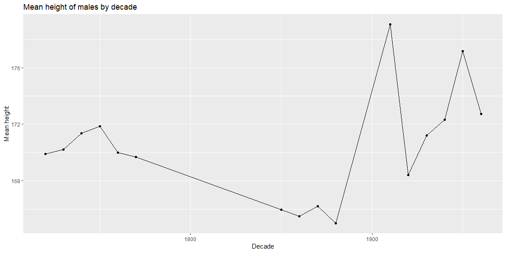

<!-- ## Reading Notes -->

<!-- ## Case Study 5 -->

### Importing and cleaning the data

#### Importing data


```r
bav_19 <- read_dta(url("https://byuistats.github.io/M335/data/heights/germanconscr.dta"))
bav_19_2 <- read_dta(url("https://byuistats.github.io/M335/data/heights/germanprison.dta"))
temp <- tempfile()
download("https://byuistats.github.io/M335/data/heights/Heights_south-east.zip", temp)
sw_ger <- read.dbf("B6090.dbf")
bls <- read_csv(url("https://github.com/hadley/r4ds/raw/master/data/heights.csv"))
```

```
## 
## -- Column specification --------------------------------------------------------
## cols(
##   earn = col_double(),
##   height = col_double(),
##   sex = col_character(),
##   ed = col_double(),
##   age = col_double(),
##   race = col_character()
## )
```

```r
uw <- read_sav(url("http://www.ssc.wisc.edu/nsfh/wave3/NSFH3%20Apr%202005%20release/main05022005.sav"))
```

#### Cleaning and combining the data


```r
bav_19_tidy <- bav_19 %>% 
  rename(birth_year = bdec, height.cm = height) %>%
  mutate(study = "bav_19") %>%
  mutate(height.in = height.cm / 2.54) %>%
  select(birth_year, height.in, height.cm, study)

bav_19_2_tidy <- bav_19_2 %>%
  rename(birth_year = bdec, height.cm = height) %>%
  mutate(study = "bav_19_2") %>%
  mutate(height.in = height.cm / 2.54) %>%
  select(birth_year, height.in, height.cm, study)

sw_ger_tidy <- sw_ger %>%
  select(GEBJ, CMETER) %>%
  rename(birth_year = GEBJ, height.cm = CMETER) %>%
  mutate(study = "sw_ger") %>%
  mutate(height.in = height.cm / 2.54) %>%
  select(birth_year, height.in, height.cm, study)

bls_tidy <- bls %>%
  filter(sex == "male") %>%
  select(height) %>%
  rename(height.in = height) %>%
  mutate(study = "bls", birth_year = 1950) %>%
  mutate(height.cm = height.in * 2.54) %>%
  select(birth_year, height.in, height.cm, study)

uw_tidy <- uw %>%
  select(DOBY, RT216I, RT216F, RE35) %>%
  # RE35 is gender (1=male), RT216 F is feet, RT216I is inches
  filter(RT216F >= 0 & RT216I >= 0 & RE35 == 1) %>%
  mutate(study = "uw", birth_year = 1900 + DOBY) %>%
  mutate(height.in = (RT216F * 12) + RT216I) %>%
  mutate(height.cm = height.in * 2.54) %>%
  select(birth_year, height.in, height.cm, study)

all_ld = bind_rows(bav_19_tidy, bav_19_2_tidy, sw_ger_tidy,
                   bls_tidy, uw_tidy)
```

### Graphs

This plot shows the heights of people in centimeters vs their birth year for each study:


```r
ggplot(all_ld, aes(x = birth_year, y = height.cm)) +
  geom_jitter(width = 10) +
  facet_grid(. ~ study) +
  theme_bw() +
  xlab("Birth year") +
  ylab("Height (cm)") +
  ggtitle("Height in cm vs Birth year")
```

<!-- -->

This plot shows that heights in the 20th century generally seem to be higher than heights in the 19th and 18th centuries.

This next plot shows the mean height by decade over time.


```r
ld_dec <- all_ld %>% mutate(dec=10*trunc(birth_year/10)) %>% group_by(dec) %>% summarise(med_height = mean(height.cm))
ggplot(ld_dec, aes(x=dec, y=med_height)) +
    geom_point() +
    xlab("Decade") +
    ylab("Mean height") +
    ggtitle("Mean height of males by decade") +
    geom_line()
```

<!-- -->

Mean height seemed to decrease in the 1700s and 1800s over time, but rapidly increased in the 1900s. This seems to show the idea that mean heights have increased over time. However, height has a significant genetic component, and the fact that the studies were from difference locations (Germany and the United States) could have impacted the data.
