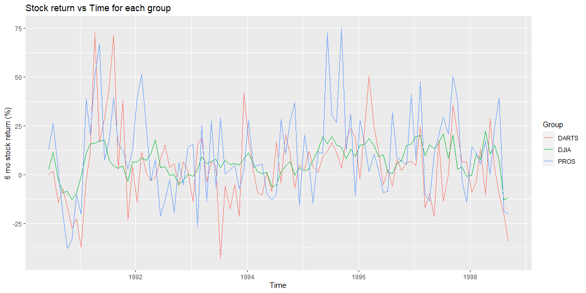

## Task 9


```r
stock_data <- read_rds(url("https://github.com/byuistats/data/blob/master/Dart_Expert_Dow_6month_anova/Dart_Expert_Dow_6month_anova.RDS?raw=true"))
```

### Time series plot


```r
stock_data2 <- stock_data %>%
  # Make sure dates are consistently formatted
  mutate(contest_period = str_replace(
    contest_period, "Dec[.]", "December"
  )) %>%
  # Correct misspelling
  mutate(contest_period = str_replace(
    contest_period, "Febuary", "February"
  )) %>%
  separate(contest_period, into = c("start","end"),
           sep = '-') %>%
  # Go into row-wise mode for strings to work
  rowwise() %>%
  mutate(year_end = unlist(
    strsplit(end,"[a-z](?=[0-9]{4}$)",perl=TRUE))[2]) %>%
  mutate(month_end = unlist(
    strsplit(end,"[0-9]{4}",perl=TRUE))[1]) %>%
  mutate(date_end = as.Date(
    paste(month_end, year_end, "10", sep = "-"),
    format = "%B-%Y-%d")) %>%
  ungroup()
stock_data2 %>%
  ggplot(mapping = aes(x = date_end, y = value)) +
  geom_line(mapping = aes(color = variable)) +
  xlab("Time") +
  ylab("6 mo stock return (%)") +
  guides(color = guide_legend("Group")) +
  ggtitle("Stock return vs Time for each group")
```

<!-- -->

### Tidy data


```r
tidy_stock <- stock_data %>%
  # Make sure dates are consistently formatted
  mutate(contest_period = str_replace(
    contest_period, "Dec[.]", "December"
  )) %>%
  # Correct misspelling
  mutate(contest_period = str_replace(
    contest_period, "Febuary", "February"
  )) %>%
  separate(contest_period, into = c("start","end"),
           sep = '-') %>%
  # Go into row-wise mode for strings to work
  rowwise() %>%
  mutate(year_end = unlist(
    strsplit(end,"[a-z](?=[0-9]{4}$)",perl=TRUE))[2]) %>%
  mutate(month_end = unlist(
    strsplit(end,"[0-9]{4}",perl=TRUE))[1]) %>%
  ungroup()
saveRDS(tidy_stock,"tidy_stock.rds")
```

### Final table


```r
stock_table <- tidy_stock %>%
  # Get only the DJIA group
  filter(variable == "DJIA") %>%
  # Get only the columns we need
  select(value, year_end, month_end) %>%
  # Find NA's
  complete(year_end, month_end) %>%
  # Fill them in
  mutate(value = replace_na(value, "-")) %>%
  # Convert to wide form
  pivot_wider(names_from = year_end, values_from = value) %>%
  # Give the month column a better name
  rename(Month = month_end) %>%
  # And sort by month
  arrange(match(Month,month.name))
# Display as a knitr table
knitr::kable(stock_table)
```


|Month     |1990  |1991 |1992 |1993 |1994 |1995 |1996 |1997 |1998  |
|:---------|:-----|:----|:----|:----|:----|:----|:----|:----|:-----|
|January   |-     |-0.8 |6.5  |-0.8 |11.2 |1.8  |15   |19.6 |-0.3  |
|February  |-     |11   |8.6  |2.5  |5.5  |3.2  |15.6 |20.1 |10.7  |
|March     |-     |15.8 |7.2  |9    |1.6  |7.3  |18.4 |9.6  |7.6   |
|April     |-     |16.2 |10.6 |5.8  |0.5  |12.8 |14.8 |15.3 |22.5  |
|May       |-     |17.3 |17.6 |6.7  |1.3  |19.5 |9    |13.3 |10.6  |
|June      |2.5   |17.7 |3.6  |7.7  |-6.2 |16   |10.2 |16.2 |15    |
|July      |11.5  |7.6  |4.2  |3.7  |-5.3 |19.6 |1.3  |20.8 |7.1   |
|August    |-2.3  |4.4  |-0.3 |7.3  |1.5  |15.3 |0.6  |8.3  |-13.1 |
|September |-9.2  |3.4  |-0.1 |5.2  |4.4  |14   |5.8  |20.2 |-11.8 |
|October   |-8.5  |4.4  |-5   |5.7  |6.9  |8.2  |7.2  |3    |-     |
|November  |-12.8 |-3.3 |-2.8 |4.9  |-0.3 |13.1 |15.1 |3.8  |-     |
|December  |-9.3  |6.6  |0.2  |8    |3.6  |9.3  |15.5 |-0.7 |-     |
