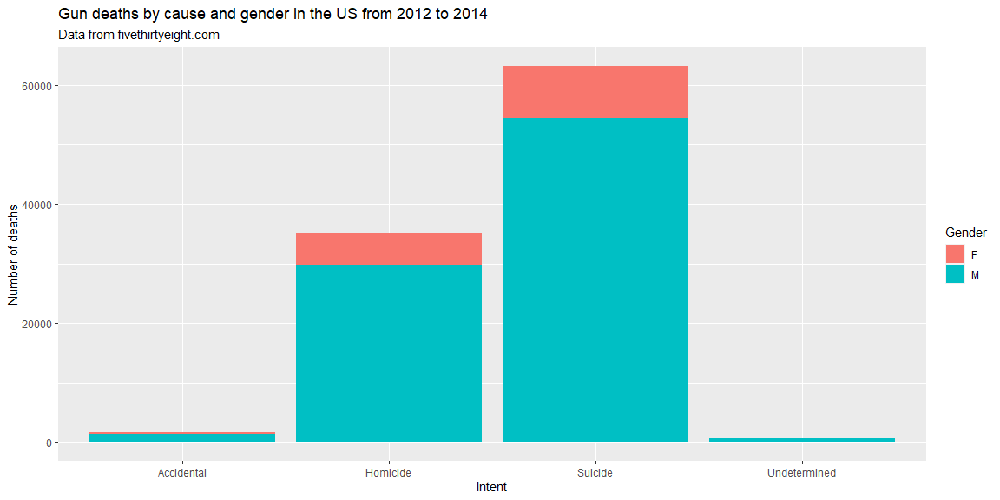
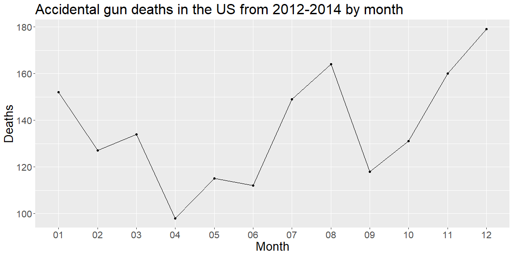
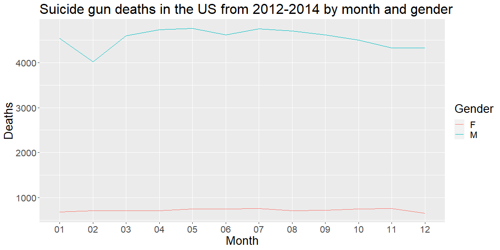

```r
library(tidyverse)
df <- read_csv("https://github.com/fivethirtyeight/guns-data/blob/master/full_data.csv?raw=true")
```

```
## Warning: Missing column names filled in: 'X1' [1]
```

## FiveThirtyEight Article

### Summary of Article

The website FiveThirtyEight.com compiled data together about gun deaths in the United States. They compiled this data from different sources about different types of gun violence, such as towards police, mass shootings, suicide, and terrorism. The website then presented visualizations that broke down the number of gun deaths by group and by cause.

### Visualization

Here is a visualization with similar insights to the ones from FiveThirtyEight.com


```r
df %>%
    filter(!is.na(intent)) %>%
    ggplot(aes(x=factor(intent))) +
    geom_bar(aes(fill=sex)) +
    guides(fill=guide_legend(title="Gender")) +
    labs(
        x = "Intent",
        y = "Number of deaths",
        title = "Gun deaths by cause and gender in the US from 2012 to 2014 ",
        subtitle = "Data from fivethirtyeight.com"
    )
```

<!-- -->

## Seasonal Trends


### Graph 1


```r
df %>%
    filter(intent == "Accidental") %>%
    group_by(month) %>%
    summarise(count = n()) %>%
    ungroup() %>%
    ggplot(aes(x=month,y=count)) +
    geom_line(aes(group=1)) +
    geom_point(aes(group=1)) +
    labs(
        x = "Month",
        y = "Deaths",
        title = "Accidental gun deaths in the US from 2012-2014 by month"
    ) +
    theme(text = element_text(size=20))
```

<!-- -->

This chart shows that accidental gun deaths spike in the summer (July and August), and also in the fall (November and December). Because of this, I would target people prone to gun related accidents. The data shows that the largest group for gun related deaths is from 15-44 years old. The data also shows that the majority of accidental gun deaths happen at home. Because these happens at home, I would focus on advertisements for gun safety at home (such as locking away firearms, etc) during the months of July, August, November, and December.

### Graph 2


```r
df %>%
    filter(intent == "Suicide") %>%
    group_by(month, sex) %>%
    summarise(count = n()) %>%
    ungroup() %>%
    ggplot(aes(x=month,y=count,color=sex)) +
    geom_line(aes(group=sex)) +
    guides(color=guide_legend(title="Gender")) +
    labs(
        x = "Month",
        y = "Deaths",
        title = "Suicide gun deaths in the US from 2012-2014 by month and gender"
    ) +
    theme(text = element_text(size=20))
```

```
## `summarise()` has grouped output by 'month'. You can override using the `.groups` argument.
```

<!-- -->

As suicide is the largest category in gun deaths in the United States, This graph shows that in all months, men are far more likely to die from gun related suicide than women. Men's suicide rates also show more seasonality than women's. Men's suicide rates are the highest between March and September. During these months, I would recommend advertising focused on suicide prevention and mental health resources, specifically directed towards men, during those months.
