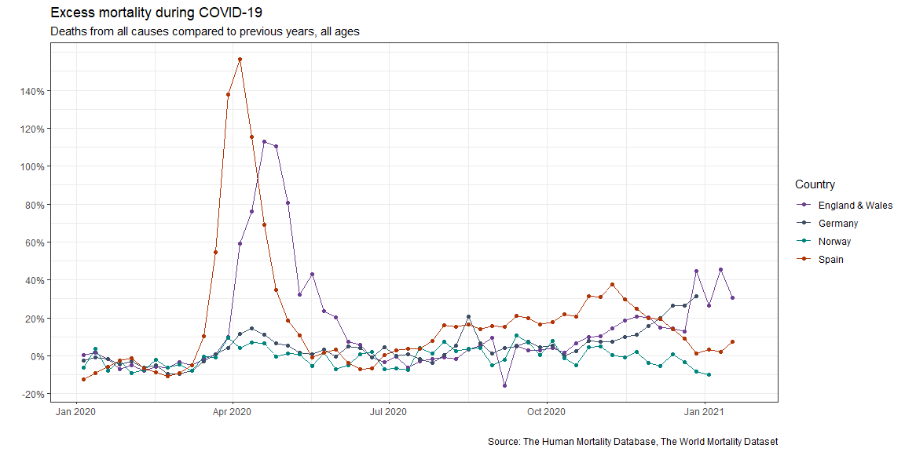
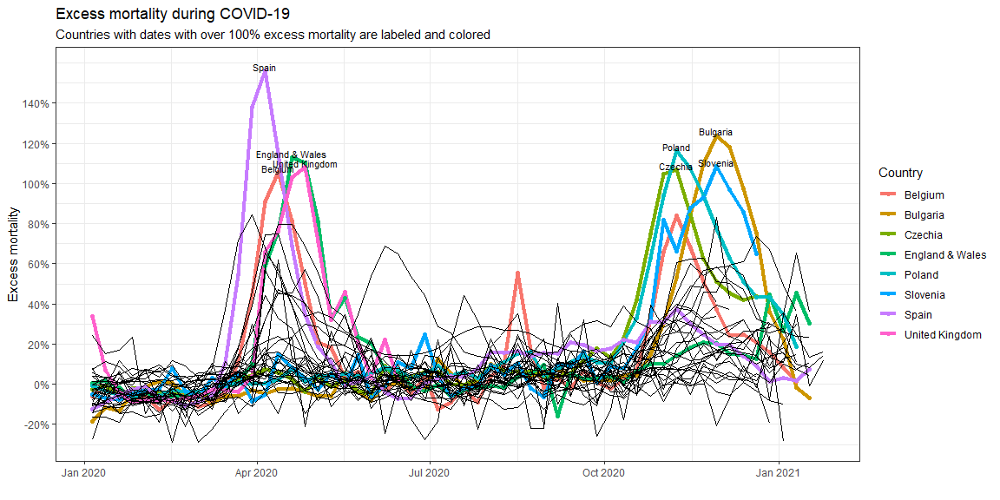
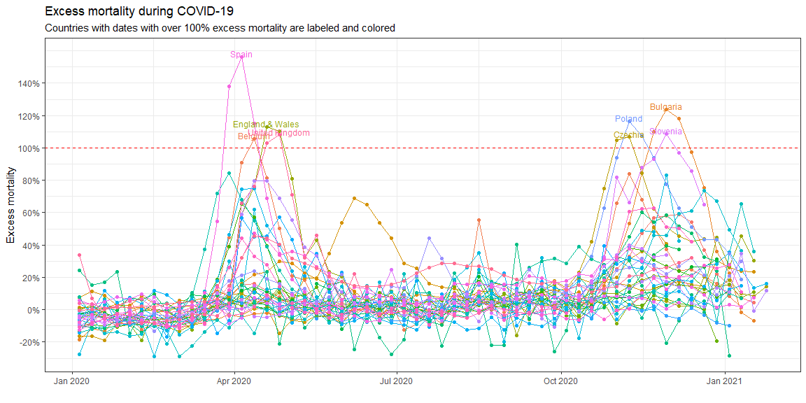
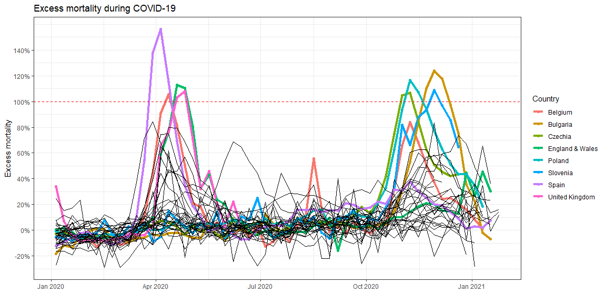
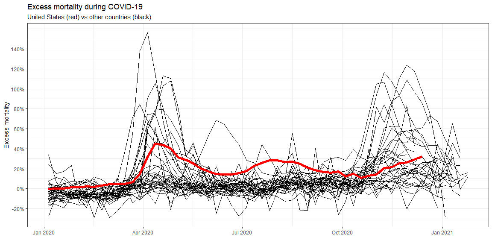
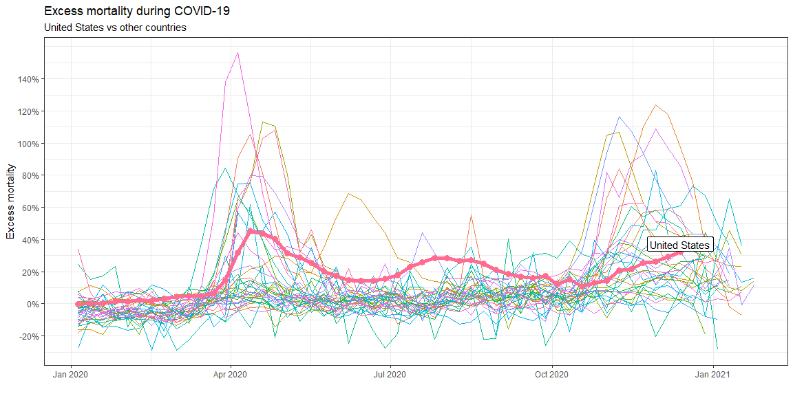

```r
library(tidyverse)
df <- read_csv("https://github.com/ktoutloud/classslides/raw/master/math335/data/M335_excess-mortality-p-scores.csv")
df <- df %>% mutate(Spain = Spain * 100)
df_tidy <- pivot_longer(df, cols = !date, names_to = "country", values_to = "pscore")
```

## First graph


```r
df_tidy %>% filter(country %in% c("England & Wales","Germany","Spain","Norway")) %>% ggplot(aes(x=date, y=pscore)) +
    geom_line(aes(color=country)) +
    geom_point(aes(color=country)) +
    theme_bw() +
    # I got these colors from the source code of the
    # original graphic
    scale_color_manual(values = c(
        `England & Wales` = "#6D3E91",
        Spain = "#B13507",
        Norway = "#00847E",
        Germany = "#3C4E66"
    )) +
    scale_y_continuous(
        breaks = seq(-20,140,by=20),
        labels = function(x) paste0(x, "%")
    ) +
    labs(
        title="Excess mortality during COVID-19",
        subtitle="Deaths from all causes compared to previous years, all ages",
        caption="Source: The Human Mortality Database, The World Mortality Dataset",
        y="",
        x=""
    ) +
    guides(color = guide_legend("Country"))
```

```
## Warning: Removed 9 row(s) containing missing values (geom_path).
```

```
## Warning: Removed 9 rows containing missing values (geom_point).
```

<!-- -->

## Points over 100%


```r
excess_mort_countries <- df_tidy %>% filter(pscore >= 100) %>% pull(country) %>% unique()
df_grouped <- df_tidy %>% mutate(g=ifelse(country %in% excess_mort_countries, 1, 0))
df_excess <- df_grouped %>% filter(g == 1)
df_normal <- df_grouped %>% filter(g == 0)
excess_top <- df_excess %>% group_by(country) %>% slice_max(order_by=pscore, n=1)
```

### Method 1: Color and label


```r
ggplot() +
    geom_line(
        data=df_excess,
        aes(x=date,y=pscore,color=country),
        size=1.5
    ) +
    geom_point(
        data=df_excess,
        aes(x=date,y=pscore,color=country)
    ) +
    geom_line(
        data=df_normal,
        aes(x=date,y=pscore,group=country),
        size=0.1
    ) +
    scale_y_continuous() +
    geom_text(
        data=excess_top,
        aes(label=country,x=date,y=pscore),
        check_overlap = FALSE,
        size=3,
        nudge_y=2
    ) +
    scale_y_continuous(
        breaks = seq(-20,140,by=20),
        labels = function(x) paste0(x, "%")
    ) +
    labs(
        title="Excess mortality during COVID-19",
        subtitle="Countries with dates with over 100% excess mortality are labeled and colored",
        y="Excess mortality",
        x=""
    ) +
    theme_bw() +
    guides(color = guide_legend("Country"))
```

```
## Scale for 'y' is already present. Adding another scale for 'y', which will
## replace the existing scale.
```

```
## Warning: Removed 49 row(s) containing missing values (geom_path).
```

```
## Warning: Removed 49 rows containing missing values (geom_point).
```

```
## Warning: Removed 132 row(s) containing missing values (geom_path).
```

<!-- -->

### Method 2: Label and horizontal line


```r
ggplot(data=df_tidy, aes(x=date,y=pscore,color=country)) +
    geom_line() +
    geom_point() +
    geom_hline(yintercept=100, color = "red", linetype="dashed") +
    geom_text(
        data=excess_top,
        aes(label=country,x=date,y=pscore),
        check_overlap = FALSE,
        size=3.25,
        nudge_y=2
    ) +
    scale_y_continuous(
        breaks = seq(-20,140,by=20),
        labels = function(x) paste0(x, "%")
    ) +
    labs(
        title="Excess mortality during COVID-19",
        subtitle="Countries with dates with over 100% excess mortality are labeled and colored",
        y="Excess mortality",
        x=""
    ) +
    theme_bw() +
    theme(legend.position = "none")
```

```
## Warning: Removed 181 row(s) containing missing values (geom_path).
```

```
## Warning: Removed 181 rows containing missing values (geom_point).
```

<!-- -->

### Method 3: Color and horizontal line


```r
ggplot() +
    geom_line(
        data=df_excess,
        aes(x=date,y=pscore,color=country),
        size=1.5
    ) +
    geom_point(
        data=df_excess,
        aes(x=date,y=pscore,color=country)
    ) +
    geom_line(
        data=df_normal,
        aes(x=date,y=pscore,group=country),
        size=0.1
    ) +
    geom_hline(yintercept=100, color = "red", linetype="dashed") +
    scale_y_continuous(
        breaks = seq(-20,140,by=20),
        labels = function(x) paste0(x, "%")
    ) +
    labs(
        title="Excess mortality during COVID-19",
        y="Excess mortality",
        x=""
    ) +
    theme_bw() +
    guides(color = guide_legend("Country"))
```

```
## Warning: Removed 49 row(s) containing missing values (geom_path).
```

```
## Warning: Removed 49 rows containing missing values (geom_point).
```

```
## Warning: Removed 132 row(s) containing missing values (geom_path).
```

<!-- -->

## US excess mortality


```r
df_countries <- df_tidy %>% 
  mutate(g=ifelse(country == "United States" , 1, 0))
df_usa <- df_countries %>% filter(g == 1)
df_int <- df_countries %>% filter(g == 0)
text_point <- df_usa %>%
    arrange(.,date) %>%
    filter(is.na(pscore) == FALSE) %>%
    tail(1)
```

### Method 1: Color

```r
ggplot(data=df_int, aes(x=date,y=pscore,group=country)) +
    geom_line(size=0.1) +
    geom_line(
        data=df_usa, 
        aes(x=date,y=pscore),
        color="red",
        size=2
    ) +
    scale_y_continuous(
        breaks = seq(-20,140,by=20),
        labels = function(x) paste0(x, "%")
    ) +
    labs(
        title="Excess mortality during COVID-19",
        subtitle="United States (red) vs other countries (black)",
        y="Excess mortality",
        x=""
    ) +
    theme_bw() +
    theme(legend.position = "none")
```

```
## Warning: Removed 175 row(s) containing missing values (geom_path).
```

```
## Warning: Removed 6 row(s) containing missing values (geom_path).
```

<!-- -->

### Method 2: Points, thickness, and label

```r
ggplot(data=df_int, aes(x=date,y=pscore,group=country)) +
    geom_line(size=0.1, aes(color=country)) +
    geom_line(
        data=df_usa, 
        aes(x=date,y=pscore,color=country),
        size=2
    ) +
    geom_point(
        data=df_usa,
        aes(x=date,y=pscore,color=country),
        size=3
    ) +
    geom_label(
        data = text_point,
        aes(x=date,y=pscore+5,label=country),
        size=4
    ) +
    scale_y_continuous(
        breaks = seq(-20,140,by=20),
        labels = function(x) paste0(x, "%")
    ) +
    labs(
        title="Excess mortality during COVID-19",
        subtitle="United States vs other countries",
        y="Excess mortality",
        x=""
    ) +
    theme_bw() +
    theme(legend.position = "none")
```

```
## Warning: Removed 175 row(s) containing missing values (geom_path).
```

```
## Warning: Removed 6 row(s) containing missing values (geom_path).
```

```
## Warning: Removed 6 rows containing missing values (geom_point).
```

<!-- -->
