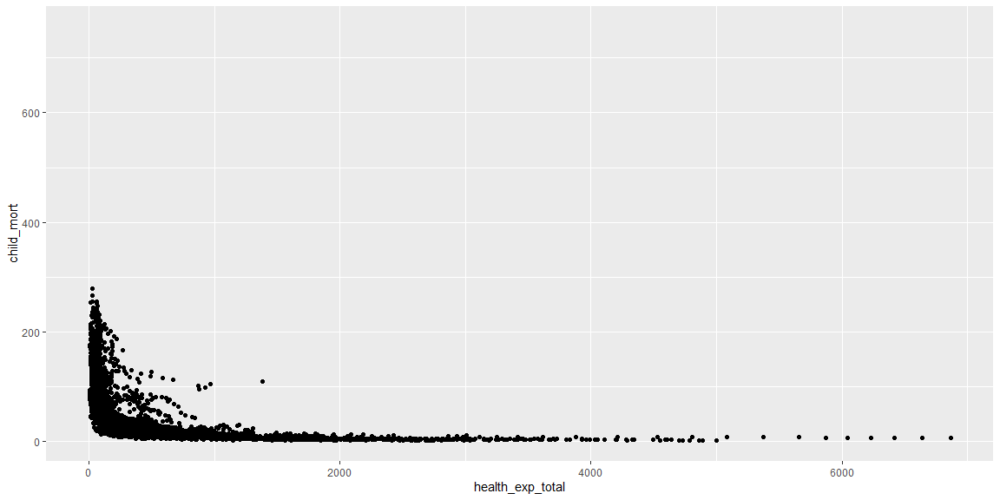
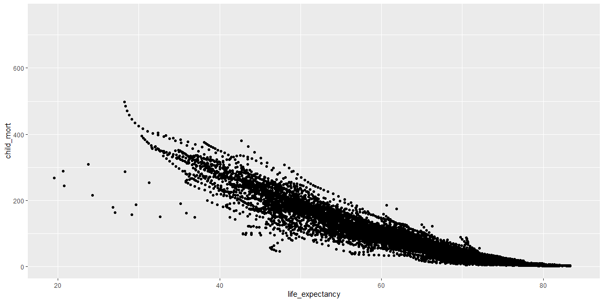
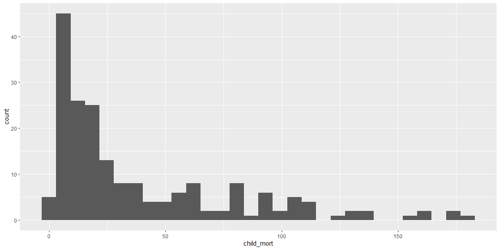
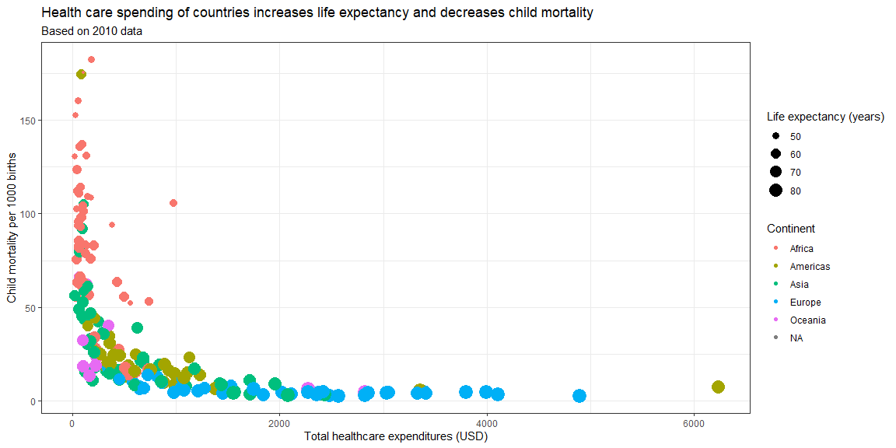

```r
library(pacman)
pacman::p_load(devtools)
pacman::p_load(tidyverse)
#devtools::install_github("drsimonj/ourworldindata")
pacman::p_load(ourworldindata)
#?financing_healthcare
```

## Exploratory data analysis


```r
fh_no_na <- financing_healthcare %>%
  filter(!is.na(health_exp_total) & !is.na(child_mort))
```

### Graph 1


```r
financing_healthcare %>%
    ggplot(aes(x=health_exp_total, y=child_mort)) +
    geom_point()
```

```
## Warning: Removed 33363 rows containing missing values (geom_point).
```

<!-- -->

### Graph 2


```r
financing_healthcare %>%
    ggplot(aes(x=life_expectancy,y=child_mort)) +
    geom_point()
```

```
## Warning: Removed 27686 rows containing missing values (geom_point).
```

<!-- -->

### Graph 3


```r
financing_healthcare %>%
    filter(year == 2010) %>%
    ggplot(aes(x=child_mort)) +
    geom_histogram()
```

```
## `stat_bin()` using `bins = 30`. Pick better value with `binwidth`.
```

```
## Warning: Removed 51 rows containing non-finite values (stat_bin).
```

<!-- -->

## Visualization for Presentation


```r
financing_healthcare %>%
    filter(year == 2010) %>%
    ggplot(aes(x=health_exp_total,y=child_mort)) +
    geom_point(aes(size=life_expectancy,color=continent)) +
    labs(
        title = "Health care spending of countries increases life expectancy and decreases child mortality",
        subtitle = "Based on 2010 data",
        x = "Total healthcare expenditures (USD)",
        y = "Child mortality per 1000 births",
        size = "Life expectancy (years)",
        color = "Continent"
    ) +
    theme_bw()
```

```
## Warning: Removed 65 rows containing missing values (geom_point).
```

<!-- -->

In this graph, I am trying to communicate that increased national health care expenditures increases life expectancy, and decreases child mortality in a country.
