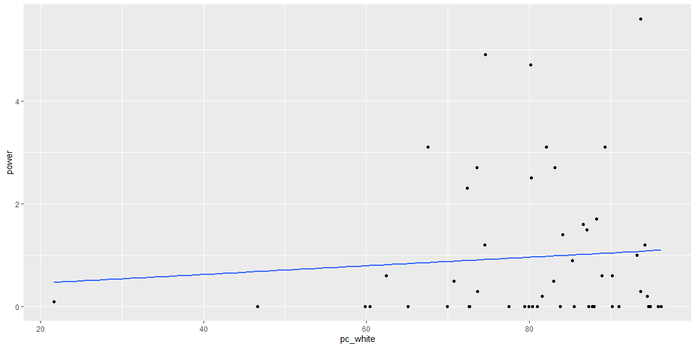
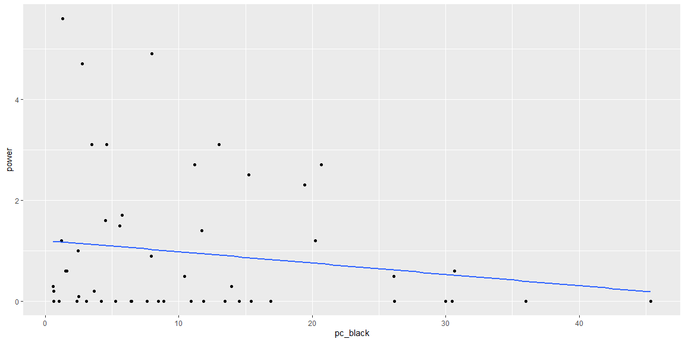
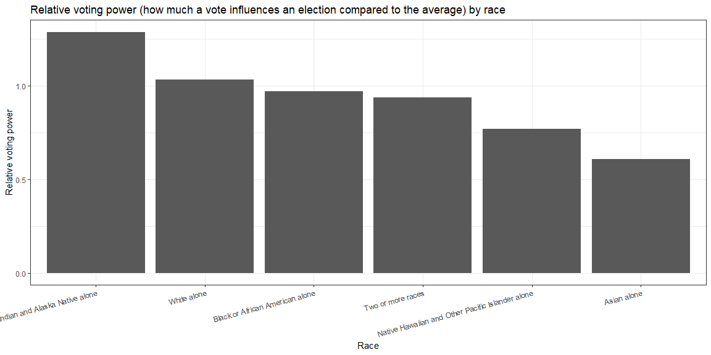
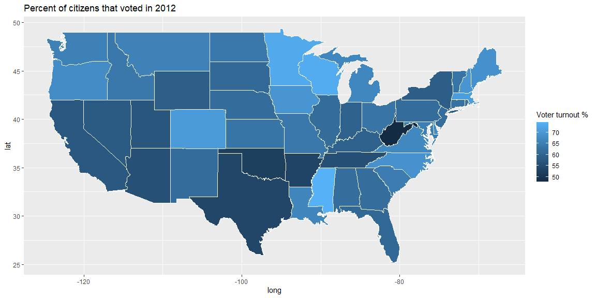

```r
library(pacman)
library(tidyverse)
pacman::p_load(maps)
pacman::p_load(stringr)
```

## Part 1

This quote resonated with me:

```
@hmason this will sound textbooky but I stop, look and think about "what's it about (phenomena, activity, entity etc). Look before see.

— Andy Kirk (@visualisingdata) June 12, 2014
```

## Part 2

### Potential data sources

* [FiveThirtyEight 2020 Election Forecast](https://github.com/fivethirtyeight/data/tree/master/election-forecasts-2020). This data is from mathematical models predicting the results of the 2020 US Elections. This could be useful to predict voting patterns by comparing the predicted and actual results.

1. [BuzzFeed Voter Power by Demographic](https://github.com/BuzzFeedNews/2016-11-voter-power-by-demographic). This dataset is useful because I want to predict how people vote by what demographic they fit in to.

2. [United States General Election Presidential Results by County from 2008 to 2020](https://github.com/tonmcg/US_County_Level_Election_Results_08-20)

3. [USA.county.data](https://github.com/Deleetdk/USA.county.data) This dataset shows a lot of demographic information for US counties. This dataset will be useful in conjuntion with the previous one. 

4. [Census Voter Data](https://github.com/timothyrenner/census_voter_data/tree/7bd4c2086fe18a42ad2d95ceb2bfabe67028d4fe) This dataset shows the voter turnout by state, and it could help shed light on voting patterns.

### Exploratory Data Analysis

#### Dataset 1

This graph shows the voter power index (likelihood that a voter in a state will determine the outcome of the Electoral College). This shows that elections often come down to the results of "swing states" in the United States, such as Nevada, New Mexico, and New Hampshire.


```r
d1 <- read_csv("https://github.com/BuzzFeedNews/2016-11-voter-power-by-demographic/blob/master/data/fivethirtyeight/voter-power-index.csv?raw=true")
states <- map_data("state")
d1_cleaned <- d1 %>%
  filter(!is.na(state)) %>%
  mutate(region = tolower(state))
d1_joined <- inner_join(states, d1_cleaned, by="region")
ggplot() +
    geom_polygon(data=d1_joined,
                 aes(x=long,y=lat,group=group,fill=power),
                 color="white",size=0.2)+
    ggtitle("Voter power index (relative likelihood that voter in state will determine Electoral College Winner)")
```

<!-- -->

This next graph shows how a states voting power changes by race. In general, voting power increases as a state has a greater percentage of white people. However, it is a weak correlation.


```r
race_data <- read_csv("https://github.com/BuzzFeedNews/2016-11-voter-power-by-demographic/blob/master/data/census/CPS%20Data%20-%20educational_attainment.csv?raw=true")
rd_clean <- race_data %>%
    fill(State) %>%
    filter(!(Race == "White alone" & is.na(Total)))
state_race <- rd_clean %>%
    select(State, Race, Total) %>%
    pivot_wider(names_from = Race, values_from = Total) %>%
    mutate(abbrev = State)
d1_state_race <- inner_join(state_race, d1_cleaned, by="abbrev")
d1_state_race %>%
    mutate(pc_white = (`White alone`/Totals) * 100) %>%
    ggplot(aes(x=pc_white,y=power)) +
    geom_point() +
    geom_smooth(method = "lm", se=FALSE)
```

<!-- -->

The next graph shows that as the percentage of a population is Black or Asian increases, the voter power decreases.


```r
d1_state_race %>%
    mutate(pc_black = (`Black or African American alone`/Totals) * 100) %>%
    ggplot(aes(x=pc_black,y=power)) +
    geom_point() +
    geom_smooth(method = "lm", se=FALSE)
```

<!-- -->

This next graph shows the "power ratio" for each race. This is calculated by getting the demographic power (multiplying the population of a race by the voter power for each state), then, at the end, grouping by race and summing up the demographic power and the total population for each race, and dividing them. The power ratio is finally divided by the average power ratio for easier comparison. 

When a power ratio is greater than 1, this demographic's vote has more weight than the average vote. The higher the power ratio, the more relative power or advantage each race has.

This graph shows that Native Americans and White people have the greatest relative power to their votes, and Asians and Pacific Islanders have the least. 

```r
rd_2 <- rd_clean %>%
    filter(State != "Totals") %>%
    mutate(abbrev = State)
demo_power <-
    inner_join(rd_2, d1_cleaned, by="abbrev") %>%
    mutate(pwr = power * Total) %>%
    group_by(Race) %>%
    summarise(race_pwr = sum(pwr), race_pop = sum(Total)) %>%
    ungroup() %>%
    mutate(power_ratio = race_pwr/race_pop)
pwr_constant <- 
    demo_power %>%
    filter(Race == "Totals") %>%
    pull(power_ratio)
demo_power2 <-
    demo_power %>%
    mutate(power_ratio = power_ratio / pwr_constant)
demo_power2 %>%
    filter(Race != "Totals") %>%
    arrange(power_ratio) %>%
    ggplot(aes(
        x=reorder(factor(Race),-power_ratio),y=power_ratio
    )) +
    geom_bar(stat="identity") +
    theme_bw() +
    theme(axis.text.x=element_text(angle=15,hjust=1)) +
    labs(
        x="Race",
        y="Relative voting power",
        title="Relative voting power (how much a vote influences an election compared to the average) by race"
    )
```

<!-- -->

Summary: This dataset has demographic data, and the "voter power index" data, but not much else. The quality is good but the data is limited. The demographic data needed a little bit of cleaning.

#### Dataset 2 & 3


```r
county_election <- read_csv("https://github.com/tonmcg/US_County_Level_Election_Results_08-20/blob/master/2016_US_County_Level_Presidential_Results.csv?raw=true")
```

```
## Warning: Missing column names filled in: 'X1' [1]
```

```r
counties <- load(url("https://github.com/Deleetdk/USA.county.data/blob/master/data/USA_county_data.RData?raw=true"))
us_counties <- map_data("county")
```
This following graph shows the percent of a county voting for the GOP by county in the 2016 election. It shows that many counties vote strongly one way or another, but many are purple, not voting strongly Republican or Democrat.


```r
usc_2 <- us_counties %>%
    mutate(polyname = paste0(region,",",subregion))
fips_map <- inner_join(usc_2,county.fips,on="polyname")
```

```
## Joining, by = "polyname"
```

```r
ce_cleaned <- county_election %>%
    mutate(fips = combined_fips)
election_map <- inner_join(fips_map,ce_cleaned,on="fips")
```

```
## Joining, by = "fips"
```

```r
election_map %>%
    ggplot() +
    geom_polygon(aes(x=long,y=lat,group=group,fill=per_gop),
                 color="white",size=0.001) +
    scale_fill_gradient(low="#0000FF",high="#FF0000") +
    labs(
        fill = "% voting GOP",
        title = "Percent voting GOP in 2016 by county"
    )
```

<!-- -->

Summary: These 2 datasets show the same thing, voting patterns by US county in the 2016 election. The second dataset shows specific candidates, however. The quality of the data is good.

#### Dataset 4


```r
turnout <- read_csv("https://github.com/timothyrenner/census_voter_data/blob/7bd4c2086fe18a42ad2d95ceb2bfabe67028d4fe/census_voter_data.csv?raw=true")
```

This graph shows voter turnout by state in 2012. I do not see any clear patterns in this map.


```r
turnout_clean <- turnout %>%
    filter(year == 2012) %>%
    filter(state != "DC") %>%
    rowwise() %>%
    mutate(region = state.name[which(state.abb == state)]) %>%
    mutate(region = tolower(region)) %>%
    mutate(tout = voter_pct_of_citizen * 100)
turnout_map <- inner_join(states, turnout_clean, by="region")
turnout_map %>%
    ggplot() +
    geom_polygon(aes(x=long,y=lat,group=group,
                   fill=tout),
                 color="white",size=0.001) +
    labs(
        fill="Voter turnout %",
        title="Percent of citizens that voted in 2012"
    )
```

<!-- -->

Summary: This dataset only shows voter turnout, but it can be useful in conjunction with other datasets. The quality of the data seems good and is tidy.

### Part 3

These datasets work well for answering the question: "What factors influence voting patterns in the United States?". 

The Voter Power Index data was especially interesting, as it shows some groups are over and under-represented. The voting data in the 2016 election is useful because it will be central to my analysis. Finally the voter turnout data will also be useful, as I can analyze it by demographic and region.
