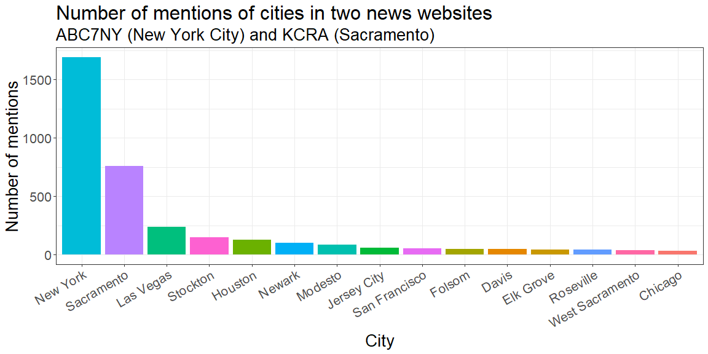
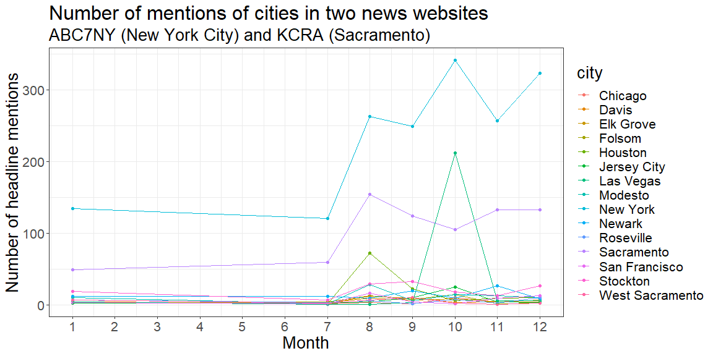
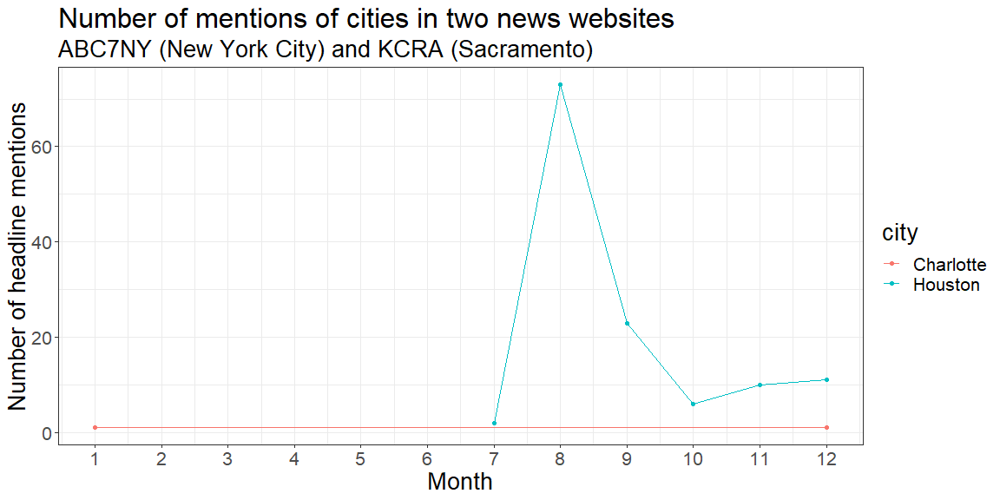

```r
library(pacman)
pacman::p_load(tidyverse, maps, lubridate)
abc <- read_csv("https://storybench.org/reinventingtv/abc7ny.csv")
kcr <- read_csv("https://storybench.org/reinventingtv/kcra.csv")
headlines <- bind_rows(abc, kcr)
```


## Question 1


```r
# Clean the city data
city_names <- us.cities %>% 
    mutate(name2 = c(str_split(name," [A-Z][A-Z]$"))) %>%
    rowwise() %>%
    mutate(name3 = name2[1]) %>%
    ungroup() %>%
    pull(name3)
city_regex <- city_names %>% str_flatten(collapse = "|")
ny_regex = "Bronx|Brooklyn|Manhattan|Queens|Staten Island"

# Get headlines with cities, remove common names
city_headlines <- headlines %>%
    # Replace words that are not cities
    mutate(
        headline =
        str_replace_all(headline, "Taylor Swift", "T Swift"),
        headline = 
        str_replace_all(
          headline,
          "Sandy Hook|torm Sandy|Sandy Kenyon",
          "Sandey"
        ),
        headline =
        str_replace_all(
            headline,
            "Roy Moore|Brian Moore",
            "Moure"
        ),
        headline =
        str_replace_all(
            headline,
            "Kim Davis|Viola Davis|Dave Davis",
            "Davus"
        ),
        headline =
        str_replace_all(
            headline,
            "Hillary Clinton|Bill Clinton|Chelsea Clinton|Clintons",
            "Clinten"
        ),
        headline =
        str_replace_all(
            headline,
            "Charlottesville|Charlotte's|Princess Charlotte",
            "Charlet"
        )
    ) %>%
    mutate(
        headline = 
        str_replace_all(headline, ny_regex, "New York City")
    ) %>%
    mutate(city = str_extract(headline, city_regex)) %>%
    filter(!is.na(city))

# 
# View(city_headlines %>%
#     mutate(cc=str_detect(headline,"Clinton")) %>%
#     filter(cc))

# Get top 15
top15 <- city_headlines %>%
    group_by(city) %>%
    summarise(count=n()) %>%
    arrange(desc(count)) %>%
    head(15)
# Use the city with the name that has the largest population
city_name_coords <- us.cities %>% 
    mutate(name2 = c(str_split(name," [A-Z][A-Z]$"))) %>%
    rowwise() %>%
    mutate(city = name2[1]) %>%
    ungroup()
top_15_coords <- 
    inner_join(city_name_coords,top15,by="city") %>%
    group_by(city) %>%
    top_n(1, abs(pop))
```


```r
top15 %>%
    ggplot(aes(x=reorder(city,-count),y=count)) +
    geom_bar(stat="identity",aes(fill=city)) +
    theme_bw() +
    theme(legend.position = "none") +
    labs(
        x = "City",
        y = "Number of mentions",
        title = "Number of mentions of cities in two news websites",
        subtitle = "ABC7NY (New York City) and KCRA (Sacramento)"
    ) +
    theme(
        text = element_text(size=20),
        axis.text.x = element_text(angle=30,hjust=1,vjust=1)
    )
```

<!-- -->

This graph shows that New York is by far the most mentioned city, with Sacramento being the next. This makes sense as these are the cities that the news stations are based in. The next city is Las Vegas, which is a bit surprising. Looking at the headlines themselves, they come from both stations, and Las Vegas is mentioned so much because of the 2017 Las Vegas shooting.

The rest of the top 15 are mainly cities near the city that the news station is based in such as Stockton, Modest, and San Francisco, which are near Sacramento, and Newark and Jersey City, which are near New York City. There are two main exceptions to this, Houston, which is in 5th place for number of mentions, and Chicago, in 15th place. Chicago is understandable because it is the 3rd most populated city in the US, however, Houston is the fourth Looking at the headlines, it seems that many of the Houston headlines were about Hurricane Harvey which struck in 2017.

## Question 2


```r
top_cities <- top15 %>% pull(city)
top_15_headlines <- city_headlines %>%
    filter(city %in% top_cities) %>%
    rowwise() %>%
    mutate(date_str = c(str_split(datetime," at "))[[1]][1]) %>%
    mutate(month = month(parse_date_time(date_str,"%b %d, %Y"))) %>%
    ungroup()
top_15_months <- top_15_headlines %>%
    group_by(month, city) %>%
    summarise(count = n())
top_15_months %>%
    ggplot(aes(x=month,y=count,group=city,color=city)) +
    geom_point() +
    geom_line() +
    theme_bw() +
    scale_x_continuous(breaks=c(1:12)) +
    labs(
        x = "Month",
        y = "Number of headline mentions",
        title = "Number of mentions of cities in two news websites",
        subtitle = "ABC7NY (New York City) and KCRA (Sacramento)"
    ) +
    theme(text = element_text(size=20))
```

<!-- -->

In this graph, the two largest cities (New York and Sacramento) seem to have an increase in the number of mentions after July. The city of Las Vegas has a large spike in mentions in October. The mentions of Las Vegas in October were nearly all about the October 2017 Las Vegas shooting. Similarly, Houston had a peak of mentions in August. These were nearly all related to Hurricane Harvey.

## Question 3


```r
hc_headlines <- city_headlines %>%
    filter(city %in% c("Charlotte","Houston")) %>%
    rowwise() %>%
    mutate(date_str = c(str_split(datetime," at "))[[1]][1]) %>%
    mutate(month = month(parse_date_time(date_str,"%b %d, %Y"))) %>%
    ungroup()
hc_months <- hc_headlines %>%
    group_by(month, city) %>%
    summarise(count = n())
```

```
## `summarise()` has grouped output by 'month'. You can override using the `.groups` argument.
```

```r
hc_months %>%
    ggplot(aes(x=month,y=count,group=city,color=city)) +
    geom_point() +
    geom_line() +
    theme_bw() +
    scale_x_continuous(breaks=c(1:12)) +
    labs(
        x = "Month",
        y = "Number of headline mentions",
        title = "Number of mentions of cities in two news websites",
        subtitle = "ABC7NY (New York City) and KCRA (Sacramento)"
    ) +
    theme(text = element_text(size=20))
```

<!-- -->

In this graph, there is no strong trend for Charlotte, NC, since there is so little data. It was only mentioned twice, once in January, and once in December. Many things similar to the city Charlotte, such as Princess Charlotte I had to filter out.

Houston, however, had a large spike in August, coinciding with Hurricane Harvey in 2017, which is what most of the articles mentioning Houston are discussing in that month. There was a decrease in September, but most of the articles then were still talking about the hurricane. After September, the mentions of the city stay at a low level and rarely talk about the hurricane.
