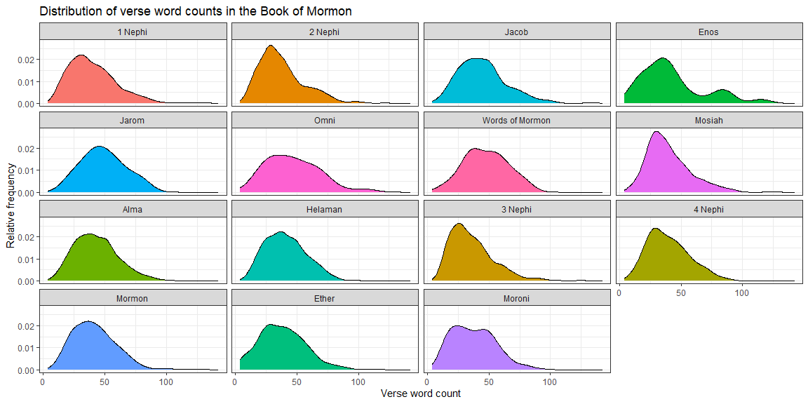

## Read in the data


```r
library(tidyverse)
library(downloader)
library(pander)
library(stringi)

download("http://scriptures.nephi.org/downloads/lds-scriptures.csv.zip", "temp.zip")
unzip("temp.zip")

# how to handle column warnings
# https://readr.tidyverse.org/articles/readr.html

scripture_data <- read_csv("lds-scriptures.csv",
               col_types = cols(book_subtitle = col_character(),
                                volume_subtitle = col_character()))
```
## What is the average verse length (number of words) in the New Testament compared to the Book of Mormon?


```r
# NT is volume id 2, BOM is 3.
scripture_data %>%
    filter(volume_id %in% c(2,3)) %>%
    mutate(tlen = str_count(scripture_text,"\\b\\w+\\b")) %>%
    select(volume_title, tlen) %>%
    group_by(volume_title) %>%
    summarise(avg_words = mean(tlen)) %>%
    rename(
      `Volume title` = volume_title,
      `Average word count` = avg_words
    ) %>%
    pander()
```


-------------------------------------
  Volume title    Average word count 
---------------- --------------------
 Book of Mormon         40.51        

 New Testament          22.71        
-------------------------------------

The Book of Mormon has an average verse length of 40.51 words, while the New Testament has a shorter average verse length of 22.71 words.

## How often is the word "Jesus" in the New Testament compared to the Book of Mormon?


```r
scripture_data %>%
    filter(volume_id %in% c(2,3)) %>%
    mutate(cnt = str_count(scripture_text,"Jesus")) %>%
    select(volume_title, cnt) %>%
    group_by(volume_title) %>%
    summarise(avg_mentions = mean(cnt)) %>%
    rename(
      `Average mentions per verse` = avg_mentions,
      `Volume title`= volume_title
    ) %>%
    pander()
```


---------------------------------------------
  Volume title    Average mentions per verse 
---------------- ----------------------------
 Book of Mormon            0.02786           

 New Testament              0.1227           
---------------------------------------------

In average mentions per verse, the New Testament is much higher than the Book of Mormon, with 0.12 mentions per verse versus the Book of Mormon's 0.028 mentions per verse.


```r
scripture_data %>%
    filter(volume_id %in% c(2,3)) %>%
    mutate(cnt = str_count(scripture_text,"Jesus")) %>%
    mutate(tlen = str_count(scripture_text,"\\b\\w+\\b")) %>%
    select(volume_title, cnt, tlen) %>%
    group_by(volume_title) %>%
    summarise(am = mean(cnt / tlen)) %>%
    rename(
        `Volume title` = volume_title,
        `Average mentions per word` = am
    ) %>%
    pander()
```


--------------------------------------------
  Volume title    Average mentions per word 
---------------- ---------------------------
 Book of Mormon           0.0007196         

 New Testament            0.005835          
--------------------------------------------

In mean mentions per word (the proportion of the words that are "Jesus"), the New Testament is ahead again, with 0.58% of words being "Jesus", compared with the Book of Mormon's 0.072% of words.

In either metric, the word "Jesus" appears more often in the New Testament than Book of Mormon.

## What does the distribution of verse word counts look like for each book in the Book of Mormon?


```r
# Books are in order by book_id
scripture_data %>%
    filter(volume_id == 3) %>%
    mutate(tlen = str_count(scripture_text,"\\b\\w+\\b")) %>%
    ggplot(aes(x = tlen)) +
    geom_density(aes(fill = book_title), show.legend = FALSE) +
    facet_wrap(~ fct_reorder(book_title,book_id)) +
    theme_bw() +
    labs(
        x = "Verse word count",
        y = "Relative frequency",
        title = "Distribution of verse word counts in the Book of Mormon"
    )
```

<!-- -->

In the Book of Mormon, the distributions of word counts in the books are all right-skewed (meaning that there is a tail of the distribution to the right). The mode (most common, at the top of the distribution curve) word count is generally between 25 and 50 words.

Two books stood out as having somewhat different distributions of words from the rest: Enos and Moroni. The book of Enos has a second spike (mode) in its frequency distribution of word count at around 85 words per verse, and the book of Moroni has a fairly flat "top" (also having two modes, but closer together) to its frequency distribution from about 20 to 50 words.
