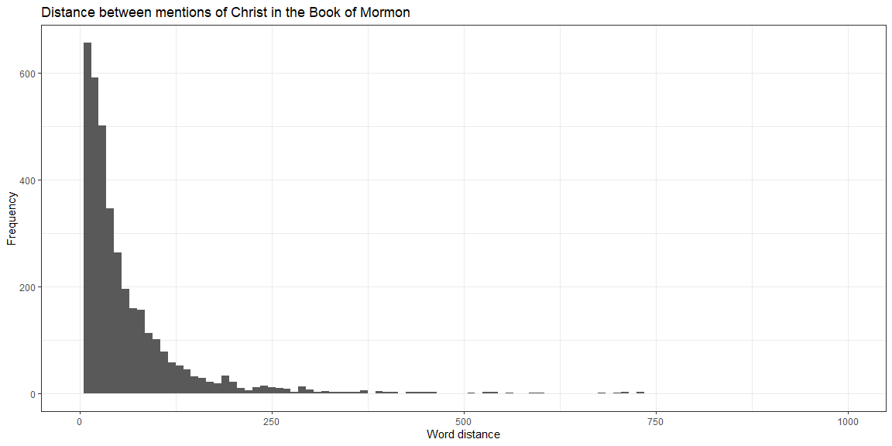

## Reading and calculating data

Steps:
1. Read in the data
2. Get BOM text as one long string and get names of Christ as a vector
3. Turn names of Christ into a regex and split BOM text on that
4. Use a map function to convert the split sentences into lengths
5. Graph the distribution

### Read in the data

```r
library(pacman)
pacman::p_load(tidyverse, stringi)
url <- "http://scriptures.nephi.org/downloads/lds-scriptures.csv.zip"
tf <- tempfile()
download.file(url, tf)
scriptures <- read_csv(unz(tf,"lds-scriptures.csv"))
bom_names <- read_rds(gzcon(url("https://byuistats.github.io/M335/data/BoM_SaviorNames.rds")))
```

### Cleaning the data

```r
s_names <- bom_names %>% pull(name)
bom <- scriptures %>% filter(volume_title == "Book of Mormon")
bom_text <- bom %>%
  pull(scripture_text) %>%
  str_flatten(collapse = " ")
```

### Calculations


```r
s_names_regex <- s_names %>%
  str_flatten(collapse = "|")
bom_text_split <- (bom_text %>% 
    str_split(s_names_regex))[[1]]
word_counts <- stri_count_words(bom_text_split)
wc_df <- as.data.frame(word_counts)
```

## Graphic


```r
ggplot(aes(x=word_counts),data=wc_df) +
    geom_histogram(binwidth=10) +
    xlim(0,1000) +
    theme_bw() +
    labs(
        title = "Distance between mentions of Christ in the Book of Mormon",
        x="Word distance",
        y="Frequency"
    )
```

```
## Warning: Removed 10 rows containing non-finite values (stat_bin).
```

```
## Warning: Removed 2 rows containing missing values (geom_bar).
```

<!-- -->

```r
c(summary(word_counts)) %>% knitr::kable()
```


|        |          x|
|:-------|----------:|
|Min.    |    0.00000|
|1st Qu. |   15.00000|
|Median  |   33.00000|
|Mean    |   64.40113|
|3rd Qu. |   72.00000|
|Max.    | 4037.00000|

This graphic and table shows that the mean (average) number of words between a name of the Savior is about 64, and the median is 33. From the graph, it is clear that the distribution of word distance is very much right-skewed, meaning that smaller distances between mentions of the Savior are more common. Right-skewed distributions are common when there is a hard lower limit on the data, and in this case there is a hard lower limit of 0 words between mentions of the Savior, so a right-skewed distribution makes sense. Because of the right-skewness, that means the distribution has a long tail on the right, meaning that there are some large values for distances between mentions. The longest I could find was 4037 words:

"[God] all his days, and to bring the wicked to justice according to their crime....And now behold, I have somewhat to say concerning the people of Ammon, who, in the beginning, were Lamanites; but by Ammon and his brethren, or rather by the power and word of [God]"

I looked up the that text, and it is from Alma 50:39 to Alma 53:10. These chapters mainly talk about government and war, and do not delve into spiritual matters. This section of text is definitely an outlier, as the next longest distance between mentions of the Savior is 2402 words.
