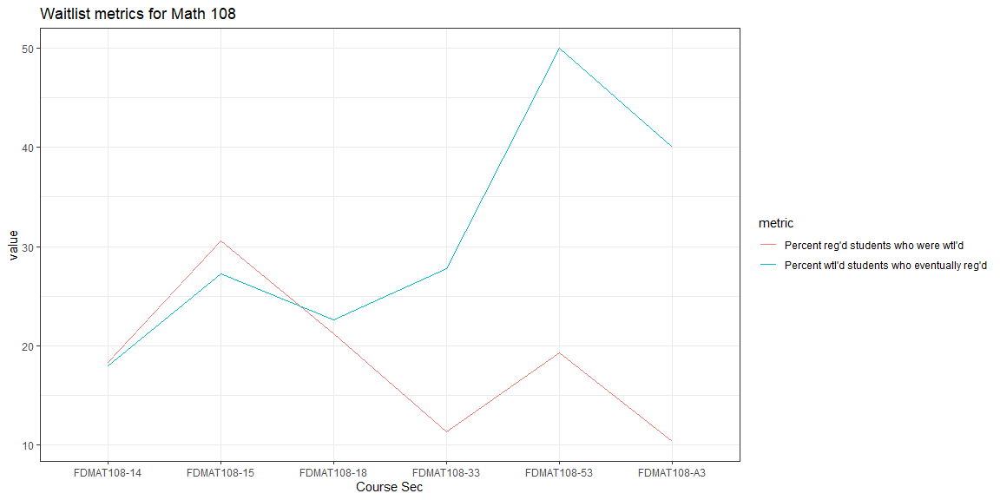
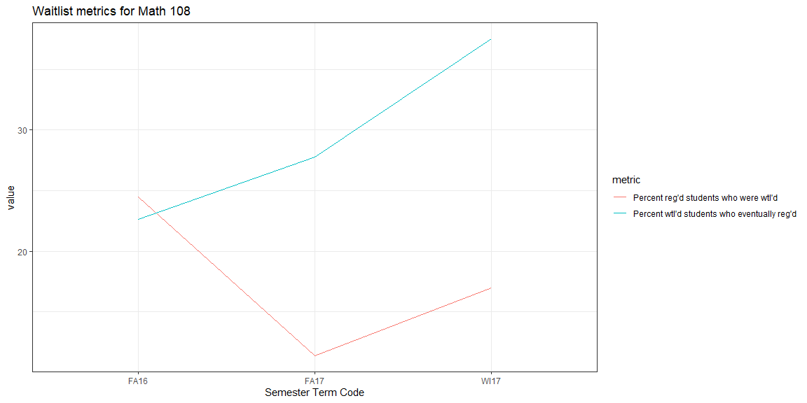

```r
library(pacman)
pacman::p_load(tidyverse, lubridate)
waitlist <- read_csv("https://byuistats.github.io/M335/data/waitlist_DP_108.csv")
```

```
## 
## -- Column specification --------------------------------------------------------
## cols(
##   `Semester Term Code` = col_character(),
##   `Person ID` = col_double(),
##   `Course Sec` = col_character(),
##   `Registration Date` = col_character(),
##   Status = col_character(),
##   `Waitlist Reason` = col_character()
## )
```

```r
waitlist <- waitlist %>% mutate(date = lubridate::mdy_hm(`Registration Date`))
percent_cur_reg_on_waitlist <- function(dat, course){
  # Keep only this course
  dat <- dat %>% filter(`Course Sec` == course)
  
  # Get all currently registered people who haven't dropped
  registered_people <- dat %>%
    arrange(`Person ID`, desc(date), desc(Status)) %>%
    distinct(`Person ID`, .keep_all = TRUE) %>%
    filter(Status == "Registered") %>%
    pull(`Person ID`)
  num_reg <- length(registered_people)
  
  # Get num people who were on the wait list and who are also currently registered
  num_waitlist_and_reg <- dat %>%
    filter(Status == "Wait List") %>%
    filter(`Person ID` %in% registered_people) %>%
    distinct(`Person ID`) %>%
    count() %>%
    pull()
  
  # Calculate the conditional probability
  # (# waitlisted ppl regd) / (# total ppl regd)
  #print(c(num_waitlist_and_reg,num_reg))
  return((num_waitlist_and_reg/num_reg) * 100)
}
percent_waitlisted_reg <- function(dat, course){
  # Keep only this course
  dat <- dat %>% filter(`Course Sec` == course)
  
   # Get all currently registered people who haven't dropped
  registered_people <- dat %>%
    arrange(`Person ID`, desc(date), desc(Status)) %>%
    distinct(`Person ID`, .keep_all = TRUE) %>%
    filter(Status == "Registered") %>%
    pull(`Person ID`)
  
  # Get num people who were on the wait list and who are also currently registered
  num_waitlist_and_reg <- dat %>%
    filter(Status == "Wait List") %>%
    filter(`Person ID` %in% registered_people) %>%
    distinct(`Person ID`) %>%
    count() %>%
    pull()
  
  # Get num people who were ever on the waitlist
  num_waitlist <- dat %>%
    filter(Status == "Wait List") %>%
    distinct(`Person ID`) %>%
    count() %>%
    pull()
  
  # Calculate the conditional probability
  # (# waitlisted ppl regd)/(# total waitlisted ppl)
  #print(c(num_waitlist_and_reg,num_waitlist))
  return((num_waitlist_and_reg/num_waitlist) * 100)
}
```

## Calculations

```r
# Get a data frame and a list of all the courses
course_df <- waitlist %>%
  group_by(`Course Sec`, `Semester Term Code`) %>%
  summarise(x=0) %>%
  select(`Course Sec`, `Semester Term Code`)
```

```
## `summarise()` has grouped output by 'Course Sec'. You can override using the `.groups` argument.
```

```r
courses <- course_df %>% pull(`Course Sec`)

# Calculate percentages for each class
percent_1 <-
  map_dbl(courses,
          function(x)percent_cur_reg_on_waitlist(waitlist,x))
percent_2 <- 
  map_dbl(courses,
          function(x)percent_waitlisted_reg(waitlist,x))

# Put these percentages in the data frame
course_df$p_wtl_g_reg <- percent_1
course_df$p_reg_g_wtl <- percent_2

# Create a long one for plotting
course_df_l <- course_df %>% 
    rename(`Percent reg'd students who were wtl'd`=
            p_wtl_g_reg,
           `Percent wtl'd students who eventually reg'd`=
            p_reg_g_wtl
           ) %>%
    pivot_longer(
        !c(`Course Sec`,`Semester Term Code`),
        names_to="metric",values_to="value")
```

## Plots


```r
ggplot(course_df_l) +
    geom_line(aes(x=`Course Sec`,y=value,color=metric,group=metric)) +
    labs(
        title = "Waitlist metrics for Math 108"
    ) +
    theme_bw()
```

<!-- -->

This plot shows the percent of waitlisted students who eventually registered, and the percent of registered students who were originally waitlisted. In most sections, it seems like the percent of waitlisted students who eventually registered is higher than the percent of registered students who were waitlisted.


```r
course_df_l %>%
    group_by(`Semester Term Code`,metric) %>%
    summarise(value = mean(value)) %>%
    ggplot() +
    geom_line(aes(x=`Semester Term Code`,y=value,color=metric,group=metric)) +
    labs(
        title = "Waitlist metrics for Math 108"
    ) +
    theme_bw()
```

```
## `summarise()` has grouped output by 'Semester Term Code'. You can override using the `.groups` argument.
```

<!-- -->

This chart shows over time, the percent of waitlisted students who eventually were able to register increased. However, the percent of registered students who were waitlisted decreased from Fall 2016 to Fall 2017, and increased in Winter 2017.
