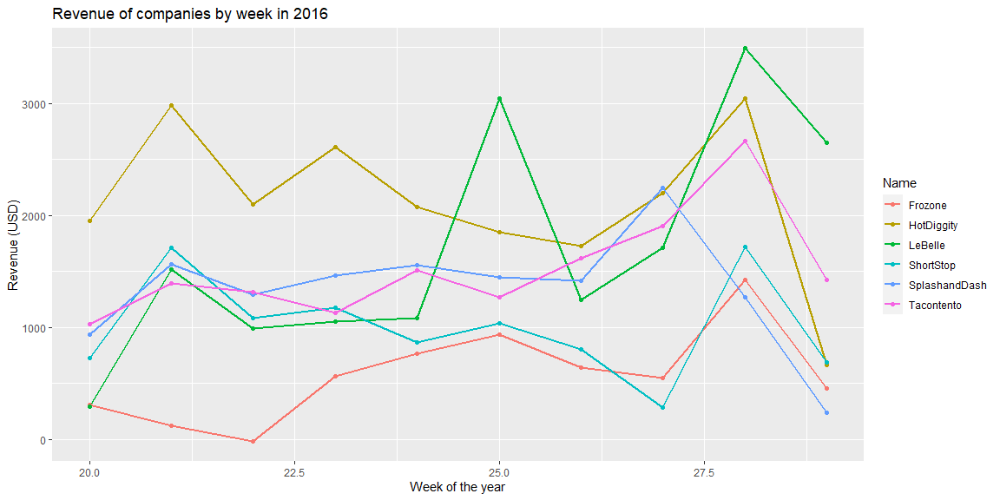
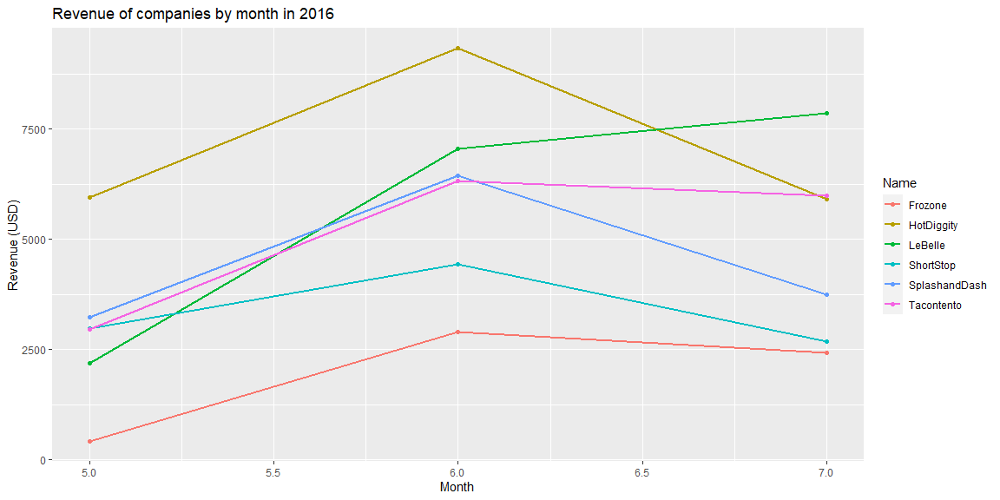
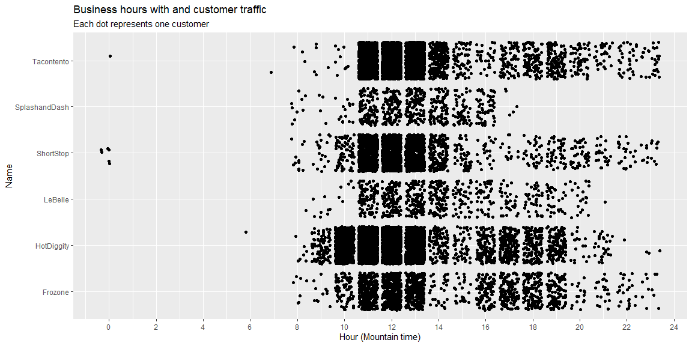
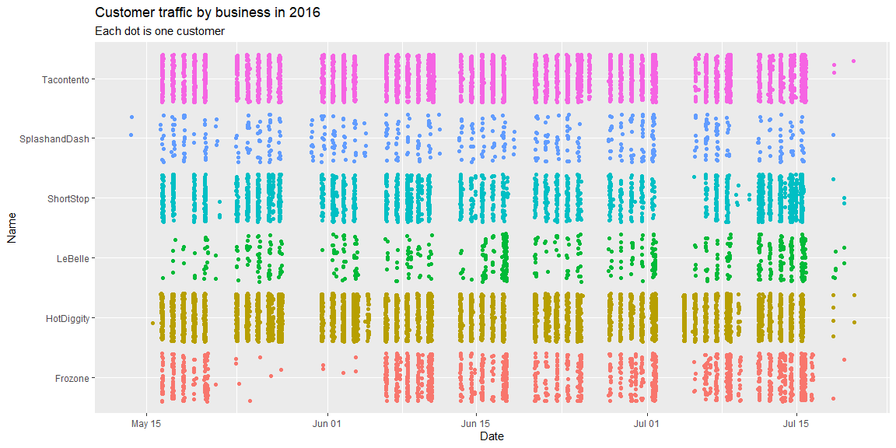

## Reading and formatting data


```r
library(pacman)
pacman::p_load(tidyverse, lubridate)
link <- "https://byuistats.github.io/M335/data/sales.csv"
df <- read_csv(link)
```

```
## 
## -- Column specification --------------------------------------------------------
## cols(
##   Name = col_character(),
##   Type = col_character(),
##   Time = col_datetime(format = ""),
##   Amount = col_double()
## )
```

```r
df2 <- df %>%
    mutate(mt_time = with_tz(Time, "America/Denver")) %>%
    filter(Name != "Missing") %>%
    mutate(week = week(mt_time),
           month = month(mt_time),
           day = yday(mt_time))

# Remove date outliers
df2 <- df2 %>% filter(month > 4)
```

## Visualizations


```r
df2 %>%
  group_by(Name, week) %>%
  summarise(rev = sum(Amount)) %>%
  ggplot(aes(x=week,y=rev,color=Name)) + 
  geom_line(size=1) +
  geom_point() +
  labs(
    x = "Week of the year",
    y = "Revenue (USD)",
    title = "Revenue of companies by week in 2016"
  )
```

<!-- -->


```r
df2 %>%
  group_by(Name, month) %>%
  summarise(rev = sum(Amount)) %>%
  ggplot(aes(x=month,y=rev,color=Name)) + 
  geom_line(size=1) +
  geom_point() +
  labs(
    x = "Month",
    y = "Revenue (USD)",
    title = "Revenue of companies by month in 2016"
  )
```

<!-- -->


```r
df2 %>% 
    ggplot(aes(x = hour(mt_time), y = Name)) +
    geom_jitter() +
    scale_x_continuous(breaks = c(seq(from=0,to=24,by=2))) +
    labs(
        x = "Hour (Mountain time)",
        y = "Name",
        title = "Business hours with and customer traffic",
        subtitle = "Each dot represents one customer"
    )
```

<!-- -->


```r
df2 %>% 
    ggplot(aes(x = mt_time, y = Name)) +
    geom_jitter(aes(color=Name)) +
    theme(legend.position = "none") +
    labs(
        x = "Date", y = "Name",
        title = "Customer traffic by business in 2016",
        subtitle = "Each dot is one customer"
    )
```

<!-- -->

## Final recommendation

I think that Hot Diggity would be the best company to invest in and performed best over the three months. It had the highest total revenue of all the companies, and had a consistent amount of customers that come in each week (compared to other companies which had more variation), making it a company with stable high profits.
