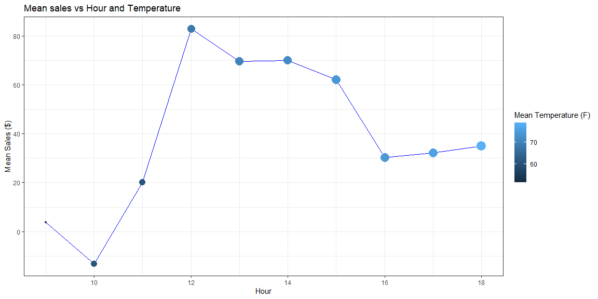

## Reading and aggregating data


```r
library(pacman)
pacman::p_load(tidyverse, lubridate, riem)
link <- "https://byuistats.github.io/M335/data/carwash.csv"
cw <- read_csv(link)
```

```
## 
## -- Column specification --------------------------------------------------------
## cols(
##   name = col_character(),
##   type = col_character(),
##   time = col_datetime(format = ""),
##   amount = col_double()
## )
```

```r
# How do negative sales work?
# Convert time zone
cw <- cw %>% mutate(time = with_tz(time,"America/Denver"))
# Create hourly grouping var  
cw <- cw %>% mutate(date_ceil = ceiling_date(time, unit="hours"))
# Aggregate the data by hour
cwa <- cw %>%
  group_by(date_ceil) %>%
  summarise(sales = sum(amount))
```

## Calculate temperatures


```r
# Get start date
dmin <- cwa %>% arrange(date_ceil) %>% head(1) %>% pull(date_ceil)
dmin_s <- strftime(dmin, "%Y-%m-%d")
# Get end date
dmax <- cwa %>% arrange(date_ceil) %>% tail(1) %>% pull(date_ceil)
dmax_s <- strftime(dmax, "%Y-%m-%d")
# Get weather data
# Actual temperatures are only posted at 53 mins
# Also convert from UTC to MDT
wx <- riem_measures(station="RXE",
                date_start=dmin_s,date_end=dmax_s) %>%
  select(valid, tmpf) %>%
  filter(!is.na(tmpf)) %>%
  mutate(valid = with_tz(valid,"America/Denver")) %>%
  mutate(date_ceil = ceiling_date(valid, unit="hours"))
```

## Joining data


```r
cw_wx <- inner_join(cwa,wx,by="date_ceil")
```

## Visualization


```r
cw_wx <- cw_wx %>%
  mutate(hr = hour(date_ceil)) %>%
  mutate(mt = month(date_ceil)) %>%
  mutate(wk = week(date_ceil))
cw_wx %>%
    mutate(Hour = hr) %>%
    group_by(Hour) %>%
    summarise(ms=mean(sales),Mean_Temp=mean(tmpf)) %>%
    ggplot(aes(y=ms)) +
    geom_line(aes(x=Hour),color="blue") +
    geom_point(aes(x=Hour,color=Mean_Temp,size=Mean_Temp)) +
    labs(
        title = "Mean sales vs Hour and Temperature",
        x = "Hour",
        y = "Mean Sales ($)",
        color = "Mean Temperature (F)"
    ) +
    theme_bw() +
    scale_size(guide="none")
```

<!-- -->

This graph shows that sales are dependent on both temperature and time. It seems like time is a strong predictor of sales. Time and temperature both influence the mean amount of sales because time and temperature are related, temperature changes with time throughout the day.
