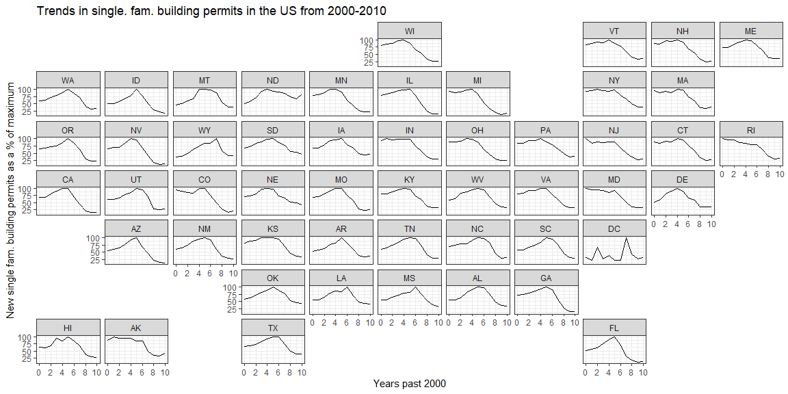
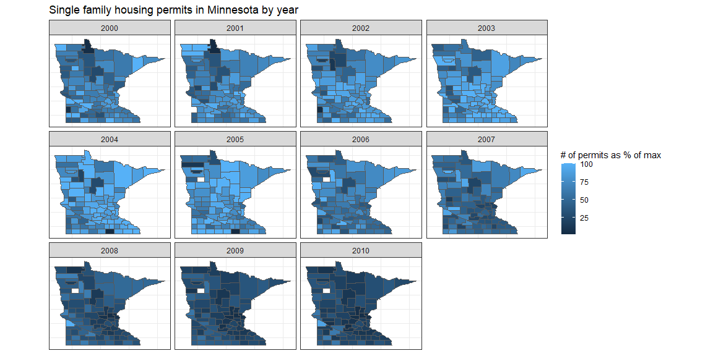
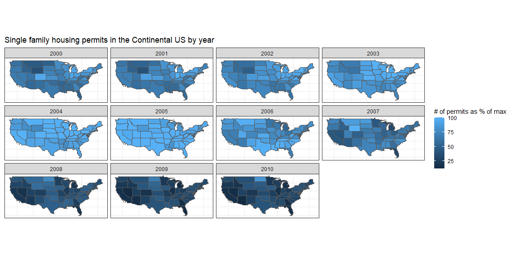

```r
library(pacman)
pacman::p_load(tidyverse, sf, USAboundaries, buildings,
               geofacet)
```
## Preparing the data


```r
f_permits <- permits %>%
    filter(variable == "Single Family") %>%
    filter(year >= 2000)
state_permits <- f_permits %>%
    group_by(state, year) %>%
    summarise(StateAbbr=StateAbbr, permits=sum(value)) %>%
    distinct() %>%
    ungroup()
```

```
## `summarise()` has grouped output by 'state', 'year'. You can override using the `.groups` argument.
```

```r
counties_tidy <- us_counties() %>%
    filter(jurisdiction_type == "state") %>%
    mutate(state=as.numeric(statefp),county=as.numeric(countyfp))
states_tidy <- us_states() %>%
    filter(jurisdiction_type == "state") %>%
    mutate(state=as.numeric(statefp))

county_permits_spatial <-
    inner_join(f_permits, counties_tidy, 
               by=c("state", "county"))
state_permits_spatial <-
    inner_join(state_permits, states_tidy, by=c("state"))

stp_max <- state_permits %>%
    group_by(state) %>%
    summarise(st_max = max(permits))
ctp_max <- f_permits %>%
    group_by(state, county) %>%
    summarise(ct_max = max(value))
```

```
## `summarise()` has grouped output by 'state'. You can override using the `.groups` argument.
```

```r
# Get state and county permits as percentage of max
stp_pc <- left_join(state_permits, stp_max, by=c("state")) %>%
    mutate(pc = permits/st_max*100)
ctp_pc <- 
    left_join(f_permits, ctp_max, by=c("state","county")) %>%
    mutate(pc = value/ct_max*100)
```

## Chart 1


```r
stp_pc %>%
    mutate(yr = year-2000) %>%
    ggplot(aes(x=yr, y=pc)) +
    geom_line() +
    facet_geo(~ StateAbbr) +
    theme_bw() +
    scale_x_continuous(breaks=c(0,2,4,6,8,10)) +
    labs(
        x = "Years past 2000",
        y = "New single fam. building permits as a % of maximum",
        title = "Trends in single. fam. building permits in the US from 2000-2010"
    )
```

<!-- -->

## Chart 2


```r
inner_join(ctp_pc, counties_tidy, by=c("state", "county")) %>%
    filter(state_abbr == "MN") %>%
    ggplot() +
    geom_sf(aes(geometry=geometry,fill=pc)) +
    facet_wrap(~ year) +
    theme_bw() +
    labs(
        fill = "# of permits as % of max",
        title = "Single family housing permits in Minnesota by year"
    ) +
    theme(axis.ticks.x=element_blank(),
          axis.text.x=element_blank(),
          axis.ticks.y=element_blank(),
          axis.text.y=element_blank())
```

<!-- -->

## Chart 3


```r
inner_join(stp_pc, states_tidy, by=c("state")) %>%
    filter(!(StateAbbr %in% c("AK","HI"))) %>%
    ggplot() +
    geom_sf(aes(geometry=geometry,fill=pc)) +
    facet_wrap(~ year) +
    labs(
        fill = "# of permits as % of max",
        title = "Single family housing permits in the Continental US by year"
    ) +
    theme_bw() +
    theme(axis.ticks.x=element_blank(),
          axis.text.x=element_blank(),
          axis.ticks.y=element_blank(),
          axis.text.y=element_blank())
```

<!-- -->

## Summary

The first chart shows the date when housing permits dropped off pretty clearly, and shows the timing and the severity of the housing crisis. The next 2 charts are very similar to each other, they show the number of housing permits in MN counties and US states respectively, grouped by year, with the relative number of housing permits shown by color. This shows the year when there were the most housing permits in each region, and how the number of housing permits in each region. In all of the graphs, the number of housing permits is represented by the percent of the maximum, this is so different regions can be compared using the same axes.
