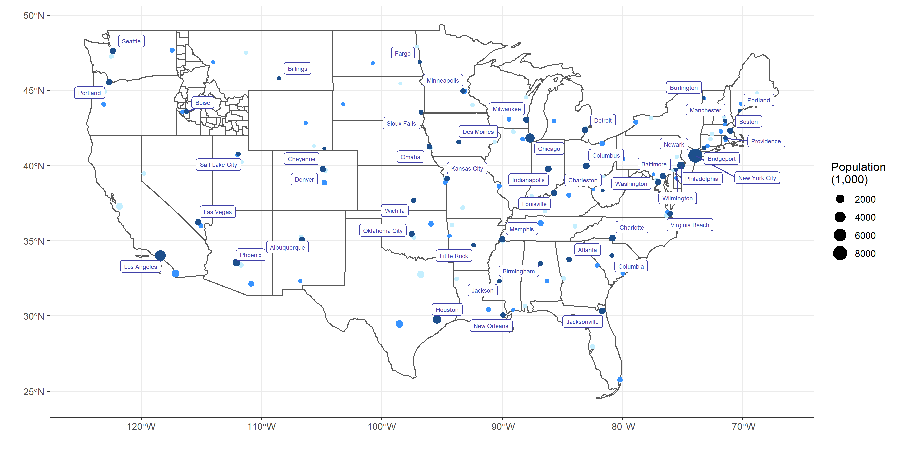

```{r, echo=FALSE}
knitr::opts_chunk$set(echo = TRUE)
```

```{r, message=FALSE, fig.show='hide', warning = FALSE}
library(tidyverse)
library(sf)
library(USAboundaries)
library(ggrepel)

conus <- us_states() %>%
    filter(jurisdiction_type == "state") %>%
    filter(!(stusps %in% c("AK","HI","ID")))
ID <- us_counties() %>%
    filter(state_abbr == "ID")
# Get top 3 cities in each state
big_cities <- us_cities() %>%
    group_by(state_name) %>%
    filter(!(state_abbr %in% c("AK","HI"))) %>%
    mutate(rank = rank(-population, ties.method="first")) %>%
    filter(rank <= 3)
# Get largest in each state with lat and lng
biggest_cities <- big_cities %>%
  filter(rank == 1) %>%
  mutate(k = list(unlist(geometry))) %>%
  rowwise() %>%
  mutate(lat = k[2], lng = k[1]) %>%
  ungroup()
# Plot the data
ggplot() +
    # Make sure the bg is transparent, fill in bg map
    geom_sf(data=conus, fill="transparent") +
    geom_sf(data=ID, fill="transparent") + 
    # Plot big cities as points with 3 dif colors by rank
    # Colors were taken from the original plot with color picker
    geom_sf(data=big_cities,
            aes(color=factor(-rank),size=population/1000)) +
    theme_bw() +
    scale_color_manual(values=c("#C4EFFF","#3893FF","#1D4F8C")) +
    guides(color = F) +
    # Plot the largest city in each state with labels
    geom_label_repel(data=biggest_cities,
                     aes(x=lng,y=lat,label=city),
                     color="#4041A8",size=2) +
    labs(
        x = "",y="",
        size = "Population\n(1,000)"
    )
# Save the plot
ggsave("plot.png", height=6, width=12)
```

