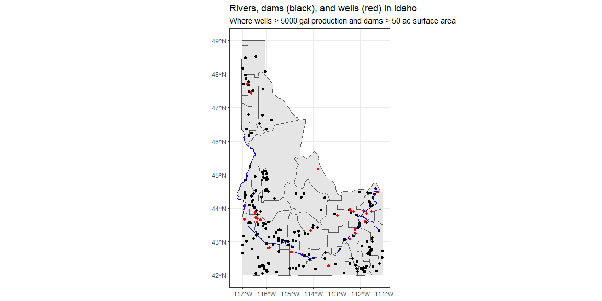

```r
# Set working directory and load libraries
library(pacman)
pacman::p_load(rio, here, tidyverse, downloader, sf, fs)

# Read in initial shapefile
my_URL_shape <- "https://byuistats.github.io/M335/data/shp.zip"
df <- tempfile(); uf <- tempfile()
download(my_URL_shape, df, mode = "wb")
unzip(df, exdir = uf)
shp <- read_sf(uf)
file_delete(df); dir_delete(uf)
id_shp <- shp %>% filter(StateName == "Idaho")

# Read in Well data
# Data folder is in the root of the project
well_file <- here("Data","Wells.zip")
unzip_folder <- tempfile()
unzip(well_file, exdir=unzip_folder)
well_shp <- read_sf(unzip_folder)
dir_delete(unzip_folder)

# Read in Dam data
dam_file <- here("Data","Dams.zip")
unzip_folder <- tempfile()
unzip(dam_file, exdir=unzip_folder)
dam_shp <- read_sf(unzip_folder)
dir_delete(unzip_folder)

# Read in water data
wat_file <- here("Data","hyd250.zip")
unzip_folder <- tempfile()
unzip(wat_file, exdir=unzip_folder)
wat_shp <- read_sf(unzip_folder)
dir_delete(unzip_folder)

# Clean data
well_shp_tidy <- well_shp %>% filter(Production > 5000)
wat_shp_tidy <- wat_shp %>%
    filter(FEAT_NAME %in% c("Snake River","Henrys Fork"))
dam_shp_tidy <- dam_shp %>% filter(SurfaceAre > 50)
# Longlat projection is rectangular, not tilted
my_proj <- "+proj=longlat +datum=WGS84"
id_shp_tidy <- id_shp %>% st_transform(crs = my_proj)
```

## Map


```r
ggplot() +
    geom_sf(data=id_shp_tidy) +
    geom_sf(data=dam_shp_tidy, color="black") +
    geom_sf(data=well_shp_tidy, color="red") +
    geom_sf(data=wat_shp_tidy, color="blue") +
    theme_bw() +
    labs(
        title = "Rivers, dams (black), and wells (red) in Idaho",
        subtitles="Where wells > 5000 gal production and dams > 50 ac surface area"
    )
```

<!-- -->

```r
#ggsave("plot.png",width=5,height=10)
```
[](plot.png)
