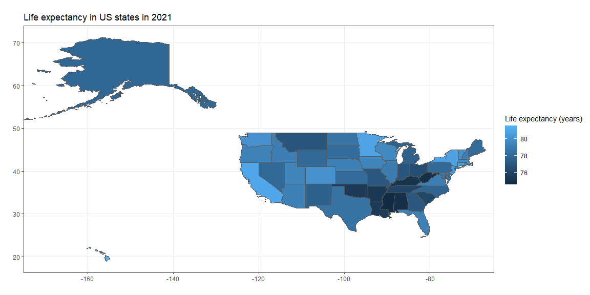

```r
library(tidyverse)
library(sf)
library(USAboundaries)
le <- read_csv("us_life_exp.csv")
```

## Visualization


```r
states <- us_states()
le_st <- le %>% 
    mutate(stusps = state.abb[match(State,state.name)])
states_le <- inner_join(le_st, states, by="stusps")
ggplot(states_le) +
    geom_sf(aes(geometry=geometry,fill=overall)) +
    xlim(-170,-70) +
    theme_bw() +
    scale_fill_continuous(name="Life expectancy (years)") +
    labs(
        X="",y="",
        title = "Life expectancy in US states in 2021"
    )
```

<!-- -->
